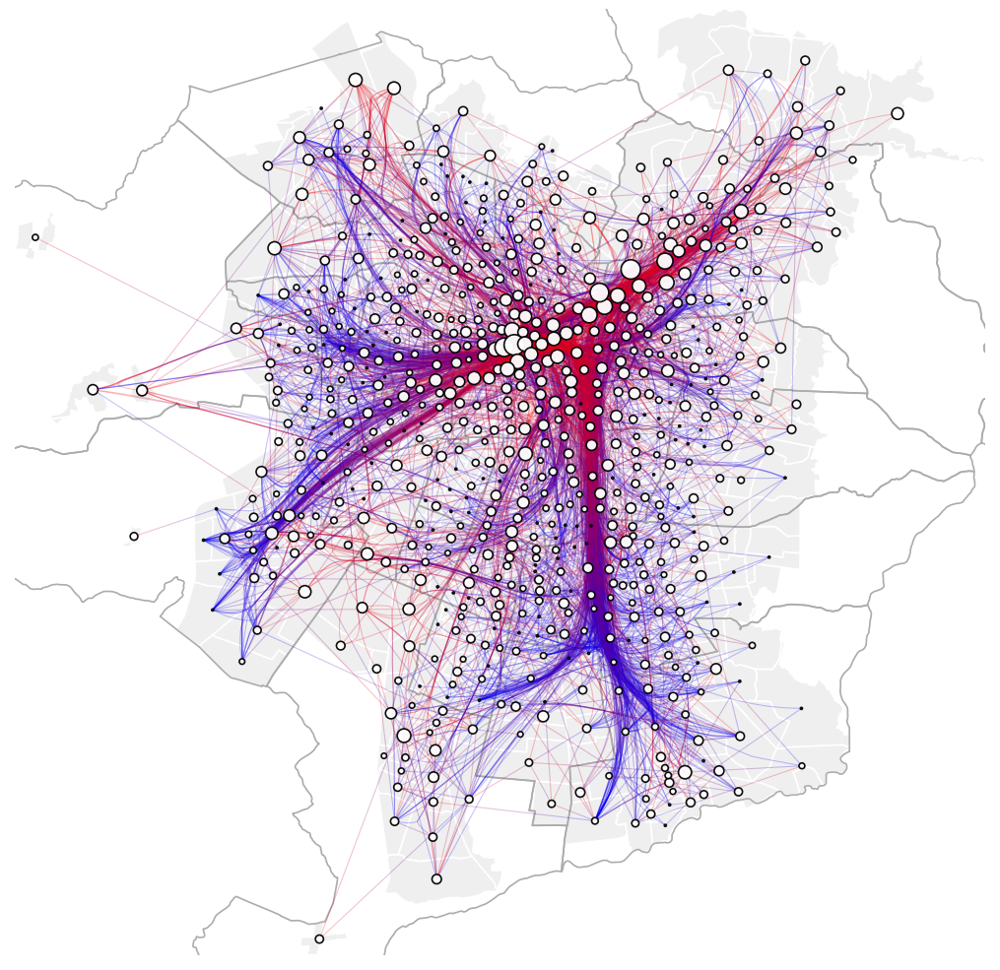
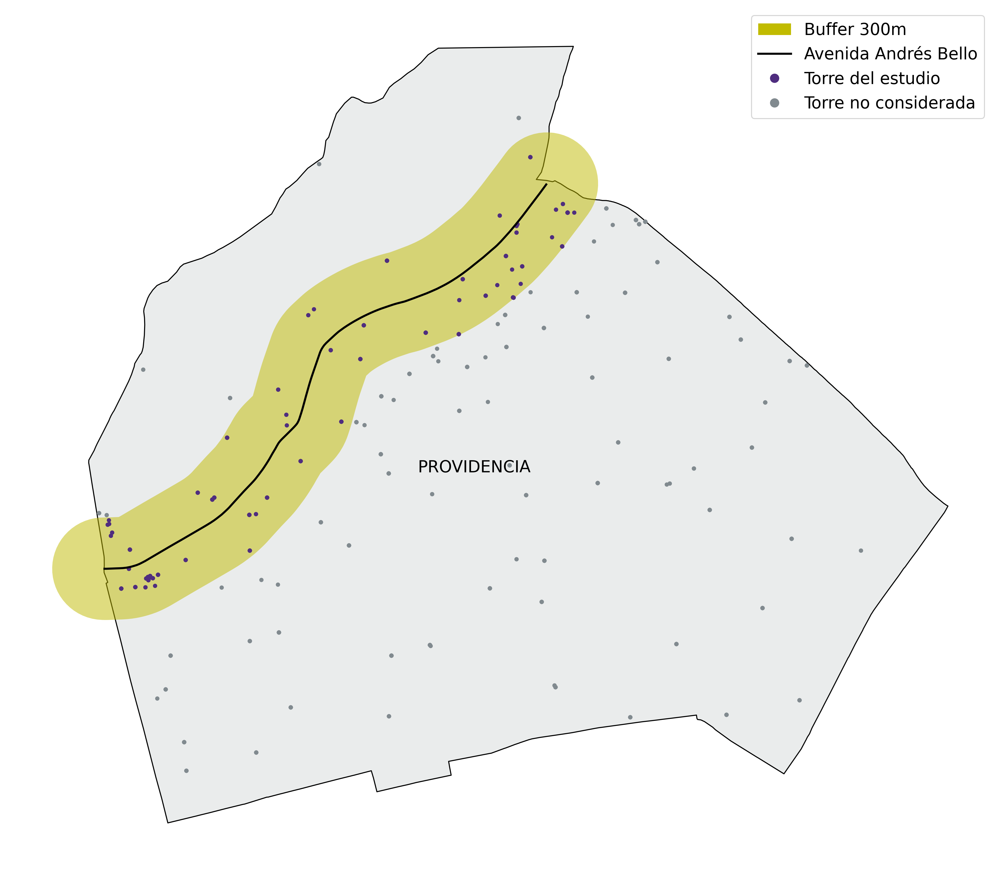
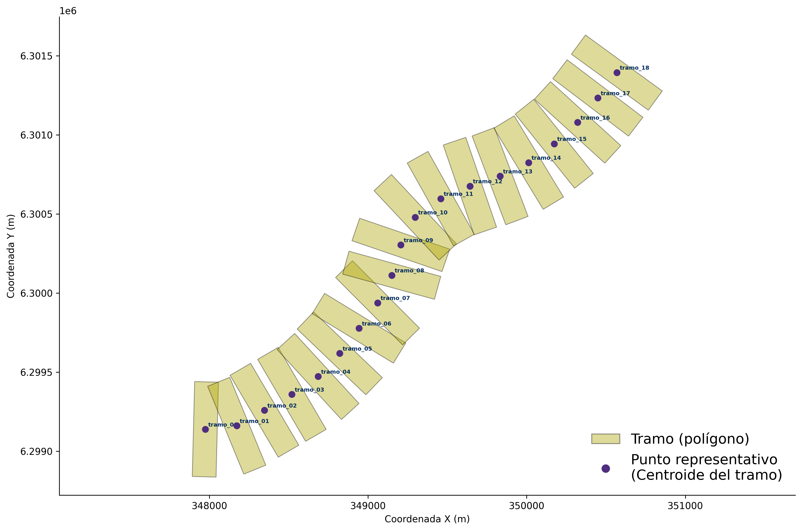

<!-- @import "style.css" -->

## Portada

    
Haz clic para ver más

    
    

<h1 style="font-size: 3.0em;">Antes y después del fin de la reversibilidad en Av. Andrés Bello: Un enfoque desde la movilidad urbana usando datos XDR.</h1>

Santiago de Chile, XX de Julio de 2025.

## 1. Introducción

    
Haz clic para ver más

Este informe documenta el trabajo realizado en el marco del proyecto, orientado a analizar los patrones de viaje urbano en Santiago de Chile, con énfasis en la **Avenida Andrés Bello**, antes y después del término de la política de reversibilidad vehicular.

El objetivo principal es caracterizar los cambios en el uso de la avenida y sus usuarios durante los años 2023 (con reversibilidad) y 2024 (sin reversibilidad), mediante el análisis masivo de registros de conexiones móviles (XDR), enriquecidos con atributos espaciales y temporales. Particular atención se dedica a identificar perfiles de usuarios, flujos AM/PM, direcciones de desplazamiento, y su relación con zonas de residencia y trabajo.

El estudio emplea técnicas avanzadas de procesamiento distribuido en PySpark, permitiendo escalar el análisis a miles de millones de registros. Se implementó un pipeline optimizado que permite reconstruir trayectorias, etiquetar viajes relevantes y agregarlos en distintas dimensiones analíticas (tipo de usuario, día, sentido, comuna, etc.).

Todos los datos utilizados en este estudio están debidamente **anonimizados y tratados de forma agregada**, cumpliendo con estándares de privacidad y protección de datos personales. No se accede a identidades reales ni se realiza seguimiento individualizado. El procesamiento de los datos se realizó íntegramente en un servidor privado de alto rendimiento perteneciente a la Universidad del Desarrollo (UDD), lo cual entrega una capa adicional de seguridad y control sobre los flujos de información sensibles.

Este trabajo corresponde a una **etapa inicial exploratoria**, cuyo propósito fue evaluar la viabilidad técnica y metodológica de obtener patrones de movilidad útiles a partir de datos de red móvil. El objetivo a largo plazo es desarrollar un sistema que permita anticipar, de forma costo-efectiva, el impacto que podría tener una medida como la eliminación o implementación de reversibilidad vial. Dado que los estudios tradicionales que fundamentan estas decisiones suelen implicar altos costos y largos plazos de ejecución, esta metodología ofrece la posibilidad de generar **evidencia preliminar temprana**, que actúe como insumo para decidir si vale la pena encargar o no una evaluación formal de impacto vial.

## 2. Descripción de los datos

    
Haz clic para ver más

### 2.1. Datos XDR

Los registros de tipo XDR (eXtended Data Records) utilizados en este estudio corresponden a eventos de conexión móvil generados por usuarios al interactuar con la red celular de Telefónica Chile. Estos eventos pueden representar conexiones de datos o señales de localización, y se caracterizan por estar georreferenciados a través de una torre celular (`bts_id`) y un identificador de celda (`cell_id`), junto con un timestamp preciso.

Los datos usados corresponden al mes de abril para los años **2023 y 2024**, exclusivamente para usuarios ubicados en el área urbana de Santiago, con una frecuencia y granularidad suficientes para reconstruir trayectorias de viaje. En total, el volumen de registros supera los **2.200 millones**, lo cual motivó el uso exclusivo de procesamiento distribuido sobre Spark.

Cada registro XDR contiene al menos los siguientes campos relevantes para el análisis:

- `id_usuario`: identificador anónimo del dispositivo
- `src_timestamp`: marca de tiempo del evento
- `cell_id`: celda de conexión
- `bts_id`: torre correspondiente a la celda

El preprocesamiento incluyó:

- **Estandarización de nombres de columnas**, ajustando diferencias entre años.
- **Enriquecimiento geográfico**, agregando la ubicación de cada torre y calculando distancias entre ellas.
- **Ordenamiento cronológico** por `id_usuario` y `timestamp` para mantener la secuencia de eventos.
- **Eliminación de columnas irrelevantes o inconsistentes**, como campos técnicos de red o duplicados.
- **Particionado eficiente** por `id_usuario`, lo cual permite aplicar transformaciones orientadas a usuario sin perder contexto temporal.
- **Validación del timestamp** para asegurar que todos los eventos pertenezcan al año indicado y evitar registros corruptos o mal fechados.

Dado el volumen y el detalle de los registros, esta capa representa la base sobre la cual se construyen todas las etapas posteriores del análisis. La calidad de estos datos es crítica, ya que cualquier error en la temporalidad o georreferenciación podría afectar la detección de trayectorias, cálculo de velocidades, o segmentación por periodo y sentido.

### 2.2. Antenas y torres

El análisis de movilidad se sustenta en la correcta georreferenciación de los eventos XDR, lo que requiere contar con una base de torres celulares (`bts_id`) asociadas a sus respectivas celdas (`cell_id`) y coordenadas geográficas. Para ello, se utilizó un dataset externo que contiene la localización precisa de cada torre y la lista de celdas que la componen.

Cada torre fue representada como un punto geográfico con coordenadas en el sistema de referencia **EPSG:4326**, permitiendo su integración con capas geográficas urbanas, zonas EOD y buffers espaciales personalizados sobre la Avenida Andrés Bello.

Los pasos realizados sobre esta base fueron:

- **Homologación de identificadores** entre los XDR y el catálogo de torres (`cell_id`, `bts_id`).
- **Construcción de una tabla maestra `trip_towers`**, donde cada fila representa una celda única, con su geometría y atributos asociados.
- **Proyección y validación espacial**, asegurando que todas las torres utilizadas en el análisis estuvieran correctamente posicionadas dentro del área urbana de Santiago.
- **Filtrado geográfico** para excluir torres sin coordenadas válidas o ubicadas fuera de la región metropolitana.

Este dataset es esencial para varios componentes del análisis:

- Permite calcular distancias entre eventos consecutivos de un mismo usuario.
- Se utiliza para identificar si un evento ocurre dentro de los buffers construidos sobre Av. Andrés Bello.
- Habilita la generación de visualizaciones espaciales ricas, como trayectorias, mapas de calor y flujos intercomunales.

Además, esta base sirvió como nexo para unir los eventos XDR con capas adicionales como zonas EOD, comunas urbanas y clusters de actividad, lo que habilita análisis comparativos más robustos.

<strong><h3>Representación de torres y buffer alrededor de Av. Andrés Bello</h3></strong>

    Gráfico de elaboración propia

### 2.3. Información geográfica

Para enriquecer el análisis de movilidad con contexto territorial, se integraron dos capas geográficas clave: **comunas urbanas de Santiago** y una capa personalizada de **buffers espaciales construidos sobre la Avenida Andrés Bello**.

#### Comunas urbanas
Se utilizó una capa poligonal oficial que define los límites de las comunas urbanas del Gran Santiago. Esta capa permitió:

- Delimitar el área de estudio.
- Asignar comuna de residencia o trabajo a cada usuario mediante intersección espacial con `home y work location`.
- Enfocar visualizaciones y análisis específicos a comunas de interés, como Providencia.

#### Buffers y geometrías sobre Av. Andrés Bello
Dado que la Avenida Andrés Bello es un eje lineal de alta movilidad, se construyó una geometría de control compuesta por:

- **Segmentos perpendiculares** al eje vial, actuando como checkpoints de los viajes. Estos polígonos corresponden a secciones de 150x600, con una separación de 200 metros entre ellos.
- **Buffers** de 300 mts alrededor de la vía, diseñados para capturar eventos de conexión cercanos, sin extenderse excesivamente hacia otras arterias.

A cada segmento se le asignó un identificador (`tramo_id`), lo cual permitió:

- Determinar si un viaje pasó por Andrés Bello (`viaja_por_ab = 1`). Solo cuando ha cruzado por al menos 2 checkpoints de forma consecutiva.
- Asignar sentido de desplazamiento (`flujo_ab`) comparando el orden en que se han cruzado dos checkpoints consecutivos de la avenida, sin importar donde empezó o terminó el viaje.
- Existen 2 categorías de clasificación del sentido del viaje (`oriente_poniente` y `poniente_oriente`).

<strong><h3>Segmentos perpendiculares sobre Av. Andrés Bello</h3></strong>

    Gráfico de elaboración propia

Para este estudio, la Avenida Andrés Bello fue delimitada entre los siguientes extremos geográficos:

- Punto A intersección con Pio Nono: [ver en Google Maps](https://www.google.com/maps?q=-33.436377099999994,-70.635417)
- Punto B intersección con Nueva Tobalaba: [ver en Google Maps](https://www.google.com/maps?q=-33.41641190000001,-70.6071452)

Estas geometrías fueron esenciales para detectar los viajes relevantes al estudio y permitir comparaciones pre y post reversibilidad

## 3. Pipeline de procesamiento

    
Haz clic para ver más

### 3.1. Construcción de transiciones y actividades

A partir de los eventos ordenados cronológicamente por usuario, se construyó un conjunto de **transiciones espaciales** entre torres consecutivas, con el fin de estimar movimientos y velocidades entre puntos de conexión.

Cada transición incluye:

- Torre de origen (`src_bts`)
- Torre de destino (`dst_bts`)
- Tiempo entre eventos (`delta_time`)
- Distancia estimada (`distance`)
- Velocidad heurística (`heuristic = distance / delta_time`)

Estas transiciones fueron agrupadas en secuencias de eventos que permitieron distinguir entre trayectos activos y momentos de inactividad. Para ello, se aplicó una **clasificación binaria `is_trip`** a cada transición, según reglas heurísticas:

- Se considera transición de viaje si la velocidad supera un cierto umbral mínimo.
- Se considera inactividad si el usuario permanece conectado a torres cercanas por tiempos prolongados.

Posteriormente, se construyó el campo **`activity_id`**, un identificador acumulativo por usuario que cambia cada vez que se detecta una transición de estado (de no viaje a viaje o viceversa). Esto permitió segmentar cada secuencia de eventos en bloques consistentes:

- `is_trip = 1` → actividad considerada como trayecto
- `is_trip = 0` → evento no asociado a desplazamiento

Este enfoque permitió conservar la estructura secuencial de los datos, respetando la temporalidad y sin necesidad de ventanas móviles artificiales.

### 3.2. Generación de viajes

Una vez segmentadas las actividades individuales de cada usuario, se extrajeron aquellas clasificadas como trayectos (`is_trip = 1`) para construir el conjunto consolidado de viajes (`trips_df`).

Cada viaje se definió como una secuencia continua de eventos de desplazamiento entre torres, y fue identificado por la combinación de `id_usuario` y `activity_id`. Para cada viaje se extrajeron los siguientes atributos clave:

- `tower_origin`: primera torre de la secuencia
- `tower_destination`: última torre de la secuencia
- `departure_time`: timestamp del primer evento
- `delta_dist`: suma de las distancias entre cada par de torres
- `duration`: tiempo total transcurrido en minutos
- `waypoint_towers`: lista de torres intermedias
- `num_events`: cantidad de transiciones que componen el viaje
- `day` y `month`: extraídos del timestamp de inicio

Estos viajes fueron almacenados en un DataFrame particionado por año, mes y día, para facilitar su lectura eficiente en etapas posteriores.

Paralelamente, se construyó el dataset `trip_segments_df`, que contiene **todas las transiciones individuales clasificadas como parte de un viaje**. Este archivo permite:

- Reconstruir trayectorias completas paso a paso
- Calcular velocidades intermedias
- Aplicar transformaciones espaciales más finas sobre el trayecto completo

Ambos datasets son claves para los análisis posteriores: `trips_df` se utiliza para agrupar, clasificar y visualizar viajes, mientras que `trip_segments_df` permite trazabilidad y reconstrucción detallada cuando es necesario.

### 3.3. Enriquecimiento espacial

Una vez definidos los viajes individuales, se procedió a incorporar información adicional relacionada con su localización y contexto temporal. Este enriquecimiento permitió filtrar los viajes relevantes para el estudio, en particular aquellos que recorren la Avenida Andrés Bello.

#### Identificación de viajes por Av. Andrés Bello

Para determinar si un viaje pasó por Andrés Bello, se utilizó la capa de **segmentos perpendiculares** creados a lo largo del eje vial. Cada segmento cuenta con un identificador único (`tramo_id`) y fue construido como un rectángulo de 150x600 metros, separado 200 metros del siguiente.

Se definió como viaje por Andrés Bello (`viaja_por_ab = 1`) a aquel que:

- Pasó por **al menos dos segmentos consecutivos** del corredor.

Este criterio evita falsos positivos causados por movimientos cercanos pero no alineados al eje vial.

#### Cálculo del sentido del viaje

Se determinó el **sentido de desplazamiento** de cada viaje que cruzó Andrés Bello, comparando el orden de los `tramo_id`:

- Si el viaje avanza de `tramo_id` bajos a altos: `poniente_oriente`
- Si el viaje avanza de `tramo_id` altos a bajos: `oriente_poniente`

Esto permite clasificar los flujos en dos grandes direcciones sin necesidad de conocer el punto de origen ni destino absoluto del viaje.

El campo `flujo_ab` incluye tres categorías:

- `oriente_poniente`
- `poniente_oriente`
- `local` (para viajes que no se pudo determinar el sentido)

#### Asignación de atributos temporales

Se incorporaron también variables temporales clave:

- `period`: clasifica cada viaje como AM (07:30–10:00) o PM (17:00–21:00)
- `dia_semana`: nombre del día correspondiente

Estas etiquetas permiten agrupar viajes por contexto horario y evaluar patrones diferenciados entre mañanas y tardes, así como días de semana versus fines de semana.

### 3.4. Localización de hogar y trabajo

Para caracterizar los patrones de movilidad de los usuarios más allá de los trayectos individuales, se estimaron sus zonas de residencia y trabajo a partir de su comportamiento agregado en distintos días y horarios.

#### Metodología

El procedimiento se basó en detectar las torres más frecuentadas por cada usuario en franjas horarias específicas, aplicando un enfoque por ventanas temporales y frecuencia de conexión:

- **Hogar (`home_location`)**: Entre las 23:00 y 06:00 en días laborales.
- **Trabajo (`work_location`)**: Entre las 09:00 y 18:00 en días laborales.

Ambas ubicaciones se registraron como `cell_id`, `bts_id`, y su geometría correspondiente (`geometry_home`, `geometry_work`), lo cual permitió su uso en análisis espaciales posteriores.

#### Aplicaciones analíticas

La localización de hogar y trabajo fue clave para:

- Asignar comuna de residencia y comuna laboral, mediante intersección con los polígonos comunales.
- Evaluar diferencias de comportamiento entre perfiles según zona de origen.
- Analizar patrones de entrada y salida hacia comunas clave como Providencia.
- Realizar visualizaciones más enriquecidas de trayectorias agregadas y perfiles de viaje.

Estos atributos están integrados en el dataset principal de usuarios, y permiten cruzar cada viaje con su contexto espacial más estable.

## 4. Perfiles de usuario

    
Haz clic para ver más

### 4.1. Clustering por intensidad de uso

Para caracterizar la diversidad de comportamiento entre los usuarios que transitan por la Avenida Andrés Bello, se aplicó una estrategia de segmentación basada en aprendizaje no supervisado.

A partir de dos variables clave:

- `num_viajes`: total de viajes por Andrés Bello durante el mes
- `dias_distintos`: número de días distintos en los que el usuario realizó viajes

se construyó un modelo de clustering para identificar perfiles de uso sin imponer categorías predefinidas.

Previo al entrenamiento, los datos fueron normalizados y filtrados de outliers para asegurar estabilidad de las métricas. Se evaluaron múltiples algoritmos de agrupamiento: **K-Means**, **Gaussian Mixture Models (GMM)** y **Aglomerativo**, seleccionando finalmente **K-Means** por su simplicidad interpretativa y su alto desempeño cuantitativo, con un **Silhouette Score de 0.8627**.

El modelo fue entrenado con los usuarios del año **2023**, y posteriormente aplicado a los usuarios del año **2024** manteniendo los mismos parámetros y rangos, lo cual permite comparaciones directas entre ambos años sin sesgo por reentrenamiento.

Se identificaron tres perfiles principales de usuarios:

- **Cluster Bajo**: baja cantidad de viajes y baja regularidad
- **Cluster Medio**: comportamiento intermedio en volumen y frecuencia
- **Cluster Alto**: usuarios intensivos, con múltiples viajes en varios días distintos

Esta clasificación se encuentra registrada en el campo `cluster_km`, y fue empleada en los análisis interanuales, comparaciones por comuna, persistencia de usuarios y visualizaciones de trayectorias.

Para validar que los perfiles generados mediante clustering (bajo, medio y alto) reflejan diferencias reales en los patrones de comportamiento, se presenta a continuación los box plot de las variables (`num_viajes`) y (`dias_distintos`). Estas distribuciones confirman que los grupos capturan comportamientos crecientemente intensivos.

<strong>
<h3 align="center">Distribución de variable <code>num_viajes</code> por perfil uso</h3>
</strong>

insertar_html_boxplot_num_viajes

    Gráfico de elaboración propia

> Los usuarios del **perfil bajo** presentan una concentración extrema de valores cercanos al mínimo (1 viaje). El **perfil medio** muestra una mediana en torno a 2–3 viajes, con ligera dispersión hacia valores más altos. El **perfil alto** se caracteriza por una mayor dispersión y una mediana más elevada (5 viajes), evidenciando una frecuencia de uso significativamente mayor.

<strong>
<h3 align="center">Distribución de variable <code>dias_distintos</code> por perfil uso</h3>
</strong>

insertar_html_boxplot_dias_distintos

    Gráfico de elaboración propia

> El **perfil bajo** está acotado a 1 día de actividad, lo que indica comportamiento esporádico. El **perfil medio** se sitúa entre 2 y 3 días distintos, con poca variabilidad. En contraste, el **perfil alto** muestra una distribución más amplia, centrada entre 4 y 6 días, con casos extremos que alcanzan 10 o más días activos. Esto demuestra que los usuarios intensivos no solo realizan más viajes, sino que lo hacen con mayor regularidad a lo largo del mes.

## 5. Variación usuarios y viajes

    
Haz clic para ver más

### 5.1. Cambios globales 2023 vs 2024

Con el objetivo de evaluar el impacto del término de la reversibilidad en Avenida Andrés Bello, se realizó una comparación cuantitativa entre los meses de abril de 2023 (con reversibilidad) y abril de 2024 (sin reversibilidad), utilizando métricas consolidadas de **todos los viajes y usuarios**.

#### Variaciones en volumen de datos

- Se procesaron más de mil millones de registros XDR por año, con una leve disminución del **2.16%** en 2024.
- El número de viajes cae desde 100,3 millones en 2023 a 95,8 millones en 2024, reflejando una baja global del **4,5%**.

Al aplicar filtros de paso por Av. Andrés Bello, horario AM/PM y sentido del flujo, se observó:

#### Variación general de usuarios y viajes

- La siguiente tabla muestra la evolución del volumen total de usuarios únicos y viajes detectados por Av. Andrés Bello durante abril, así como la relación promedio de viajes por usuario.

| categoría       | 2023   | 2024   | variación % |
|:---------------:|-------:|-------:|------------:|
| usuarios únicos | 18.250 | 11.884 | -34,88      |
| total viajes    | 23.449 | 15.555 | -33,66      |
| viajes/usuario  | 1,28   | 1,31   | 1,87        |

    Tabla de elaboración propia

> A pesar de la fuerte caída en la cantidad de usuarios y viajes, el promedio de viajes por usuario se mantuvo constante o incluso subió levemente, lo que sugiere que los usuarios más intensivos siguieron usando la vía.

#### Cambios en usuarios únicos por sentido y periodo

La siguiente tabla descompone la cantidad de usuarios únicos según el sentido del flujo y la franja horaria (AM/PM).

| sentido del flujo  | periodo | 2023  | 2024  | variación % |
|:------------------:|:-------:|------:|------:|------------:|
| oriente a poniente | AM      | 3.253 | 2.159 | -33,63 %    |
|                    | PM      | 7.237 | 4.403 | -39,16 %    |
| poniente a oriente | AM      | 4.618 | 3.081 | -33,28 %    |
|                    | PM      | 5.521 | 3.800 | -31,17 %    |

    Tabla de elaboración propia

> El impacto de la reversibilidad parece haber sido más fuerte en el periodo **PM**, especialmente en el flujo **oriente a poniente**, lo que podría indicar una reorganización del viaje de retorno tras la jornada laboral.

#### Cambios en volumen de viajes por sentido y periodo

Aquí se compara la cantidad total de viajes en cada combinación de sentido y franja horaria:

| sentido del flujo  | periodo | 2023  | 2024  | variación % |
|:------------------:|:-------:|------:|------:|------------:|
| oriente a poniente | AM      | 3.647 | 2.504 | -31,34 %    |
|                    | PM      | 8.344 | 5.172 | -38,02 %    |
| poniente a oriente | AM      | 5.171 | 3.527 | -31,79 %    |
|                    | PM      | 6.287 | 4.352 | -30,78 %    |

    Tabla de elaboración propia

> Nuevamente, el periodo PM muestra las caídas más grandes, lo que refuerza la idea de que el término de la reversibilidad impactó más en los trayectos de retorno.

#### Variación en intensidad: viajes por usuario

Este cuadro muestra la intensidad de uso promedio (viajes por usuario) en cada combinación:

| sentido del flujo  | periodo | 2023 | 2024 | variación % |
|:------------------:|:-------:|-----:|-----:|------------:|
| oriente a poniente | AM      | 1,12 | 1,16 | 3,45 %      |
|                    | PM      | 1,15 | 1,17 | 1,88 %      |
| poniente a oriente | AM      | 1,12 | 1,14 | 2,23 %      |
|                    | PM      | 1,14 | 1,15 | 0,57 %      |

    Tabla de elaboración propia

> Si bien el número de usuarios cae, los que permanecen realizan una cantidad similar o incluso levemente superior de viajes. Esto refuerza la hipótesis de **desaparición de usuarios ocasionales**, con retención de perfiles más intensivos.

#### Distribución de usuarios por perfil de uso

La tabla muestra cómo varió la composición de usuarios por clúster:

| perfil | 2023   | 2024  | variación % |
|:------:|-------:|------:|------------:|
| bajo   | 15.544 | 9.981 | -35,79 %    |
| medio  | 2.304  | 1.571 | -31,81 %    |
| alto   | 402    | 332   | -17,41 %    |

    Tabla de elaboración propia

> El perfil **alto** de uso fue el menos afectado por la caída. Esto sugiere que los usuarios con viajes sistemáticos mantuvieron su patrón, mientras que los perfiles más esporádicos fueron los más impactados.

#### Distribución de viajes por perfil de uso

Finalmente, se analiza la distribución de viajes por tipo de usuario:

| perfil | 2023   | 2024   | variación % |
|:------:|-------:|-------:|------------:|
| bajo   | 15.870 | 10.091 | -36,41 %    |
| medio  | 5.316  | 3.623  | -31,85 %    |
| alto   | 2.263  | 1.841  | -18,65 %    |

    Tabla de elaboración propia

> La caída en cantidad de viajes sigue el mismo patrón: los usuarios bajos reducen drásticamente su volumen, mientras que los usuarios altos mantienen gran parte de su movilidad.

#### Promedio de viajes por usuario según perfil de uso

Esta tabla muestra la relación promedio de viajes por usuario dentro de cada perfil, permitiendo observar si la intensidad individual cambió, más allá del volumen total.

| perfil | 2023 | 2024 | variación % |
|:------:|-----:|-----:|------------:|
| bajo   | 1,02 | 1,01 | -0,97 %     |
| medio  | 2,31 | 2,31 | -0,05 %     |
| alto   | 5,63 | 5,55 | -1,50 %     |

    Tabla de elaboración propia

> El número de viajes promedio por usuario se mantuvo prácticamente constante en todos los perfiles, con variaciones menores al 2%. Esto refuerza la idea de que el cambio estructural vino por la pérdida de usuarios, y no por un cambio en la conducta individual de quienes permanecieron activos.

### 5.2 Cambios en usuarios en la cohorte estable

En esta sección se analiza exclusivamente a los **1.871 usuarios que estuvieron presentes tanto en abril de 2023 como en abril de 2024**. Esto permite evaluar cambios de comportamiento dentro de una misma población, eliminando la influencia de usuarios que aparecen o desaparecen entre años.

El total de viajes realizados por esta cohorte se redujo de **3.713 en 2023** a **3.474 en 2024**, lo que representa una caída moderada del **6,44%**.

> A diferencia de la caída global observada en la sección anterior, que fue superior al 30%, la disminución en la cohorte estable es **más acotada**, lo que sugiere que los cambios generales se explican principalmente por la desaparición de usuarios esporádicos o marginales.

#### Cambios por flujo y periodo

El desglose por sentido y franja horaria muestra que los **usuarios únicos** de la cohorte disminuyeron ligeramente en casi todas las combinaciones, pero sin grandes variaciones:

| sentido del flujo  | periodo | 2023 | 2024 | variación % |
|:-------------------|:--------|-----:|-----:|------------:|
| oriente a poniente | AM      | 505  | 453  | -10,30 %    |
|                    | PM      | 853  | 781  | -8,44 %     |
| poniente a oriente | AM      | 591  | 573  | -3,05 %     |
|                    | PM      | 706  | 684  | -3,12 %     |

- El flujo **oriente a poniente** en AM y PM presenta reducciones de entre **-8% y -10%**.
- El flujo **poniente a oriente**, en cambio, muestra variaciones más leves (entre **-3% y -3,1%**).

En cuanto al **volumen de viajes**, los patrones son similares, con caídas del orden de **-7% a -8%** en oriente a poniente, y valores casi estables en poniente a oriente (especialmente en AM, donde apenas varía un -0,39%).

| sentido del flujo  | periodo |   2023 |   2024 | variación % |
|:------------------:|:-------:|-------:|-------:|------------:|
| oriente a poniente | AM      | 673    | 615    | -8,62 %     |
|                    | PM      | 1.229  | 1.138  | -7,40 %     |
| poniente a oriente | AM      | 778    | 775    | -0,39 %     |
|                    | PM      | 1.033  | 946    | -8,42 %     |

> Los datos sugieren una **leve contracción del uso** en la cohorte estable, especialmente en dirección **oriente a poniente**, que podría relacionarse con un cambio en los modos de transporte utilizados en el retorno a casa.

#### Viajes promedio por usuario

Al analizar la intensidad de uso (viajes por usuario), se observa lo siguiente:

| sentido del flujo  | periodo | 2023 | 2024 | variación % |
|:------------------:|:-------:|-----:|-----:|------------:|
| oriente a poniente | AM      | 1,33 | 1,36 | 1,87 %      |
|                    | PM      | 1,44 | 1,46 | 1,13 %      |
| poniente a oriente | AM      | 1,32 | 1,35 | 2,74 %      |
|                    | PM      | 1,46 | 1,38 | -5,48 %     |

- Hay un **aumento leve** en la mayoría de las combinaciones AM (entre 1,1% y 2,7%).
- Sin embargo, en **PM / poniente a oriente**, se registra una caída significativa de **-5,48%**.

Aunque los viajes totales bajaron, los usuarios que se mantuvieron tienden a conservar sus hábitos, con aumentos marginales en la mañana y una caída puntual en la tarde hacia el oriente. Esto podría estar relacionado con trayectos alternativos.

> En conjunto, estos resultados sugieren que **los cambios observados en el conjunto total se explican más por composición de usuarios que por modificaciones de comportamiento en quienes se mantienen activos**.

### 5.3 Transiciones de perfil de uso (cohorte estable)

Para entender cómo evolucionó el comportamiento de los usuarios que estuvieron presentes en ambos años (cohorte estable), se construyó un gráfico de tipo Sankey que visualiza las transiciones de **perfil de uso** entre abril de 2023 y abril de 2024.

Cada nodo representa un grupo de usuarios según su perfil (bajo, medio, alto), y cada flujo entre nodos indica cuántos usuarios cambiaron (o no) de perfil. Además, se incluyen las variaciones promedio de viajes por mes y días activos por usuario para cada transición. El gráfico permite observar si los usuarios se mantuvieron estables, aumentaron o redujeron su nivel de uso, más allá de la cantidad absoluta de viajes.

    <strong>Simbología de colores:</strong> 
    
    <strong>Aumento de uso:</strong> usuarios que pasaron a un perfil más intensivo en 2024. 
    
    <strong>Sin cambio de uso:</strong> usuarios que mantuvieron su perfil entre años. 
    
    <strong>Disminución de uso:</strong> usuarios que redujeron su intensidad de uso.

> Nota: El orden vertical de los nodos no representa jerarquía. Para identificar las transiciones, observe las etiquetas y colores según la simbología incluida. Cada flujo representa la cantidad de usuarios que pasó de un perfil a otro, junto con variaciones promedio en viajes diarios (Δ viajes) y días activos (Δ días).

<strong>
<h3 align="center">Transiciones de perfiles de usuario: abril 2023 → abril 2024</h3>
</strong>

insertar_html_sankey_perfiles

    Gráfico de elaboración propia

**Estabilidad mayoritaria, pero no dominante**: 3 de las 9 transiciones representan usuarios que no cambiaron de perfil (bajo→bajo, medio→medio, alto→alto), sumando 1.075 usuarios (≈ 57.5 % del total). La mayoría mantuvo comportamiento, pero un 42.5 % cambió de perfil.

**Transiciones descendentes: tendencia dominante**: Las tres mayores caídas de perfil (alto→bajo, alto→medio, medio→bajo) involucran a 451 usuarios. Estas transiciones muestran fuertes reducciones en actividad, con caídas promedio de hasta −4 viajes y −3 días activos (alto→bajo).

**Pocas, pero claras transiciones ascendentes**: Casos como bajo→alto (47 usuarios) y medio→alto (68 usuarios) presentan los mayores incrementos en viajes y días activos, con subidas promedio de hasta +3 días.

**Estabilidad más común en perfiles bajos**: El mayor grupo es bajo→bajo con 803 usuarios (≈ 43 % del total), todos con cero variación promedio. Esto sugiere un uso marginal y sostenido, sin afectación significativa del cambio vial.

> En conjunto, los resultados indican que, si bien más de la mitad de los usuarios mantuvo su perfil, existe una fracción importante que **redujo su intensidad de uso** en 2024. Este fenómeno se alinea con los descensos globales observados en viajes, y refuerza la hipótesis de un ajuste moderado en la conducta de parte de los usuarios estables.

## 6. Home y work location

    
Haz clic para ver más

<strong><h3>Home Location de usuarios de Andrés Bello</h3></strong>
insertar_html_mapa_homeloc

    Gráfico de elaboración propia

>

<strong><h3>Work Location de usuarios de Andrés Bello</h3></strong>
insertar_html_mapa_workloc

    Gráfico de elaboración propia

>

<strong><h3> Flujo entre home y work location de usuarios de Andrés Bello</h3></strong>
insertar_html_sankey_home_work

    Gráfico de elaboración propia

>

## 7. XXXXXXX

    
Haz clic para ver más

## 8. XXXXXXX

    
Haz clic para ver más

## 9. XXXXXXX

    
Haz clic para ver más

