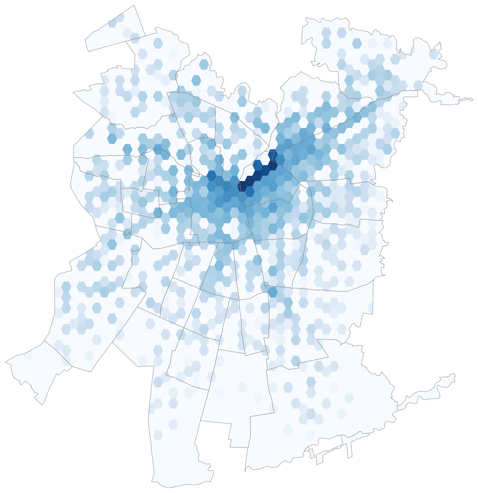

<!-- @import "style.css" -->

## Portada

    
Haz clic para ver más

    
    

<h1 style="font-size: 3.0em;">Antes y después del fin de la reversibilidad en Av. Andrés Bello: Un enfoque desde la movilidad urbana usando datos XDR.</h1>

Santiago de Chile, 14 de Julio de 2025.

## 1. Introducción

    
Haz clic para ver más

Este informe documenta el trabajo realizado en el marco del proyecto, orientado a analizar los patrones de viaje urbano en Santiago de Chile, con énfasis en la **Avenida Andrés Bello**, antes y después del término de la política de reversibilidad vehicular.

El objetivo principal es caracterizar los cambios en el uso de la avenida y sus usuarios durante los años 2023 (con reversibilidad) y 2024 (sin reversibilidad), mediante el análisis masivo de registros de conexiones móviles (XDR), enriquecidos con atributos espaciales y temporales. Particular atención se dedica a identificar perfiles de usuarios, flujos AM/PM, direcciones de desplazamiento, y su relación con zonas de residencia y trabajo.

El estudio emplea técnicas avanzadas de procesamiento distribuido en PySpark, permitiendo escalar el análisis a miles de millones de registros. Se implementó un pipeline optimizado que permite reconstruir trayectorias, etiquetar viajes relevantes y agregarlos en distintas dimensiones analíticas (tipo de usuario, día, sentido, comuna, etc.).

Todos los datos utilizados en este estudio están debidamente **anonimizados y tratados de forma agregada**, cumpliendo con estándares de privacidad y protección de datos personales. No se accede a identidades reales ni se realiza seguimiento individualizado. El procesamiento de los datos se realizó íntegramente en un servidor privado de alto rendimiento perteneciente a la Universidad del Desarrollo (UDD), lo cual entrega una capa adicional de seguridad y control sobre los flujos de información sensibles.

Este trabajo corresponde a una **etapa inicial exploratoria**, cuyo propósito fue evaluar la viabilidad técnica y metodológica de obtener patrones de movilidad útiles a partir de datos de red móvil. El objetivo a largo plazo es desarrollar un sistema que permita anticipar, de forma costo-efectiva, el impacto que podría tener una medida como la eliminación o implementación de reversibilidad vial. Dado que los estudios tradicionales que fundamentan estas decisiones suelen implicar altos costos y largos plazos de ejecución, esta metodología ofrece la posibilidad de generar **evidencia preliminar temprana**, que actúe como insumo para decidir si vale la pena encargar o no una evaluación formal de impacto vial.

## 2. Descripción de los datos

    
Haz clic para ver más

### 2.1. Datos XDR

Los registros de tipo XDR (eXtended Data Records) utilizados en este estudio corresponden a eventos de conexión móvil generados por usuarios al interactuar con la red celular de Telefónica Chile. Estos eventos pueden representar conexiones de datos o señales de localización, y se caracterizan por estar georreferenciados a través de una torre celular (`bts_id`) y un identificador de celda (`cell_id`), junto con un timestamp preciso.

Los datos usados corresponden al mes de abril para los años **2023 y 2024**, exclusivamente para usuarios ubicados en el área urbana de Santiago, con una frecuencia y granularidad suficientes para reconstruir trayectorias de viaje. En total, el volumen de registros supera los **2.200 millones**, lo cual motivó el uso exclusivo de procesamiento distribuido sobre Spark.

Cada registro XDR contiene al menos los siguientes campos relevantes para el análisis:

- `id_usuario`: identificador anónimo del dispositivo
- `src_timestamp`: marca de tiempo del evento
- `cell_id`: celda de conexión
- `bts_id`: torre correspondiente a la celda

El preprocesamiento incluyó:

- **Estandarización de nombres de columnas**, ajustando diferencias entre años.
- **Enriquecimiento geográfico**, agregando la ubicación de cada torre y calculando distancias entre ellas.
- **Ordenamiento cronológico** por `id_usuario` y `timestamp` para mantener la secuencia de eventos.
- **Eliminación de columnas irrelevantes o inconsistentes**, como campos técnicos de red o duplicados.
- **Particionado eficiente** por `id_usuario`, lo cual permite aplicar transformaciones orientadas a usuario sin perder contexto temporal.
- **Validación del timestamp** para asegurar que todos los eventos pertenezcan al año indicado y evitar registros corruptos o mal fechados.

Dado el volumen y el detalle de los registros, esta capa representa la base sobre la cual se construyen todas las etapas posteriores del análisis. La calidad de estos datos es crítica, ya que cualquier error en la temporalidad o georreferenciación podría afectar la detección de trayectorias, cálculo de velocidades, o segmentación por periodo y sentido.

### 2.2. Antenas y torres

El análisis de movilidad se sustenta en la correcta georreferenciación de los eventos XDR, lo que requiere contar con una base de torres celulares (`bts_id`) asociadas a sus respectivas celdas (`cell_id`) y coordenadas geográficas. Para ello, se utilizó un dataset externo que contiene la localización precisa de cada torre y la lista de celdas que la componen.

Cada torre fue representada como un punto geográfico con coordenadas en el sistema de referencia **EPSG:4326**, permitiendo su integración con capas geográficas urbanas, zonas EOD y buffers espaciales personalizados sobre la Avenida Andrés Bello.

Los pasos realizados sobre esta base fueron:

- **Homologación de identificadores** entre los XDR y el catálogo de torres (`cell_id`, `bts_id`).
- **Construcción de una tabla maestra `trip_towers`**, donde cada fila representa una celda única, con su geometría y atributos asociados.
- **Proyección y validación espacial**, asegurando que todas las torres utilizadas en el análisis estuvieran correctamente posicionadas dentro del área urbana de Santiago.
- **Filtrado geográfico** para excluir torres sin coordenadas válidas o ubicadas fuera de la región metropolitana.

Este dataset es esencial para varios componentes del análisis:

- Permite calcular distancias entre eventos consecutivos de un mismo usuario.
- Se utiliza para identificar si un evento ocurre dentro de los buffers construidos sobre Av. Andrés Bello.
- Habilita la generación de visualizaciones espaciales ricas, como trayectorias, mapas de calor y flujos intercomunales.

Además, esta base sirvió como nexo para unir los eventos XDR con capas adicionales como zonas EOD, comunas urbanas y clusters de actividad, lo que habilita análisis comparativos más robustos.

<strong><h3>Representación de torres y buffer alrededor de Av. Andrés Bello</h3></strong>

    Gráfico de elaboración propia

### 2.3. Información geográfica

Para enriquecer el análisis de movilidad con contexto territorial, se integraron dos capas geográficas clave: **comunas urbanas de Santiago** y una capa personalizada de **buffers espaciales construidos sobre la Avenida Andrés Bello**.

#### Comunas urbanas
Se utilizó una capa poligonal oficial que define los límites de las comunas urbanas del Gran Santiago. Esta capa permitió:

- Delimitar el área de estudio.
- Asignar comuna de residencia o trabajo a cada usuario mediante intersección espacial con `home y work location`.
- Enfocar visualizaciones y análisis específicos a comunas de interés, como Providencia.

#### Buffers y geometrías sobre Av. Andrés Bello
Dado que la Avenida Andrés Bello es un eje lineal de alta movilidad, se construyó una geometría de control compuesta por:

- **Segmentos perpendiculares** al eje vial, actuando como checkpoints de los viajes. Estos polígonos corresponden a secciones de 150x600, con una separación de 200 metros entre ellos.
- **Buffers** de 300 mts alrededor de la vía, diseñados para capturar eventos de conexión cercanos, sin extenderse excesivamente hacia otras arterias.

A cada segmento se le asignó un identificador (`tramo_id`), lo cual permitió:

- Determinar si un viaje pasó por Andrés Bello (`viaja_por_ab = 1`). Solo cuando ha cruzado por al menos 2 checkpoints de forma consecutiva.
- Asignar sentido de desplazamiento (`flujo_ab`) comparando el orden en que se han cruzado dos checkpoints consecutivos de la avenida, sin importar donde empezó o terminó el viaje.
- Existen 2 categorías de clasificación del sentido del viaje (`oriente_poniente` y `poniente_oriente`).

<strong><h3>Segmentos perpendiculares sobre Av. Andrés Bello</h3></strong>

    Gráfico de elaboración propia

Para este estudio, la Avenida Andrés Bello fue delimitada entre los siguientes extremos geográficos:

- Punto A intersección con Pio Nono: [ver en Google Maps](https://www.google.com/maps?q=-33.436377099999994,-70.635417)
- Punto B intersección con Nueva Tobalaba: [ver en Google Maps](https://www.google.com/maps?q=-33.41641190000001,-70.6071452)

Estas geometrías fueron esenciales para detectar los viajes relevantes al estudio y permitir comparaciones pre y post reversibilidad

## 3. Pipeline de procesamiento

    
Haz clic para ver más

### 3.1. Construcción de transiciones y actividades

A partir de los eventos ordenados cronológicamente por usuario, se construyó un conjunto de **transiciones espaciales** entre torres consecutivas, con el fin de estimar movimientos y velocidades entre puntos de conexión.

Cada transición incluye:

- Torre de origen (`src_bts`)
- Torre de destino (`dst_bts`)
- Tiempo entre eventos (`delta_time`)
- Distancia estimada (`distance`)
- Velocidad heurística (`heuristic = distance / delta_time`)

Estas transiciones fueron agrupadas en secuencias de eventos que permitieron distinguir entre trayectos activos y momentos de inactividad. Para ello, se aplicó una **clasificación binaria `is_trip`** a cada transición, según reglas heurísticas:

- Se considera transición de viaje si la velocidad supera un cierto umbral mínimo.
- Se considera inactividad si el usuario permanece conectado a torres cercanas por tiempos prolongados.

Posteriormente, se construyó el campo **`activity_id`**, un identificador acumulativo por usuario que cambia cada vez que se detecta una transición de estado (de no viaje a viaje o viceversa). Esto permitió segmentar cada secuencia de eventos en bloques consistentes:

- `is_trip = 1` → actividad considerada como trayecto
- `is_trip = 0` → evento no asociado a desplazamiento

Este enfoque permitió conservar la estructura secuencial de los datos, respetando la temporalidad y sin necesidad de ventanas móviles artificiales.

### 3.2. Generación de viajes

Una vez segmentadas las actividades individuales de cada usuario, se extrajeron aquellas clasificadas como trayectos (`is_trip = 1`) para construir el conjunto consolidado de viajes (`trips_df`).

Cada viaje se definió como una secuencia continua de eventos de desplazamiento entre torres, y fue identificado por la combinación de `id_usuario` y `activity_id`. Para cada viaje se extrajeron los siguientes atributos clave:

- `tower_origin`: primera torre de la secuencia
- `tower_destination`: última torre de la secuencia
- `departure_time`: timestamp del primer evento
- `delta_dist`: suma de las distancias entre cada par de torres
- `duration`: tiempo total transcurrido en minutos
- `waypoint_towers`: lista de torres intermedias
- `num_events`: cantidad de transiciones que componen el viaje
- `day` y `month`: extraídos del timestamp de inicio

Estos viajes fueron almacenados en un DataFrame particionado por año, mes y día, para facilitar su lectura eficiente en etapas posteriores.

Paralelamente, se construyó el dataset `trip_segments_df`, que contiene **todas las transiciones individuales clasificadas como parte de un viaje**. Este archivo permite:

- Reconstruir trayectorias completas paso a paso
- Calcular velocidades intermedias
- Aplicar transformaciones espaciales más finas sobre el trayecto completo

Ambos datasets son claves para los análisis posteriores: `trips_df` se utiliza para agrupar, clasificar y visualizar viajes, mientras que `trip_segments_df` permite trazabilidad y reconstrucción detallada cuando es necesario.

### 3.3. Enriquecimiento espacial

Una vez definidos los viajes individuales, se procedió a incorporar información adicional relacionada con su localización y contexto temporal. Este enriquecimiento permitió filtrar los viajes relevantes para el estudio, en particular aquellos que recorren la Avenida Andrés Bello.

#### Identificación de viajes por Av. Andrés Bello

Para determinar si un viaje pasó por Andrés Bello, se utilizó la capa de **segmentos perpendiculares** creados a lo largo del eje vial. Cada segmento cuenta con un identificador único (`tramo_id`) y fue construido como un rectángulo de 150x600 metros, separado 200 metros del siguiente.

Se definió como viaje por Andrés Bello (`viaja_por_ab = 1`) a aquel que:

- Pasó por **al menos dos segmentos consecutivos** del corredor.

Este criterio evita falsos positivos causados por movimientos cercanos pero no alineados al eje vial.

#### Cálculo del sentido del viaje

Se determinó el **sentido de desplazamiento** de cada viaje que cruzó Andrés Bello, comparando el orden de los `tramo_id`:

- Si el viaje avanza de `tramo_id` bajos a altos: `poniente_oriente`
- Si el viaje avanza de `tramo_id` altos a bajos: `oriente_poniente`

Esto permite clasificar los flujos en dos grandes direcciones sin necesidad de conocer el punto de origen ni destino absoluto del viaje.

El campo `flujo_ab` incluye tres categorías:

- `oriente_poniente`
- `poniente_oriente`
- `local` (para viajes que no se pudo determinar el sentido)

#### Asignación de atributos temporales

Se incorporaron también variables temporales clave:

- `period`: clasifica cada viaje como AM (07:30–10:00) o PM (17:00–21:00)
- `dia_semana`: nombre del día correspondiente

Estas etiquetas permiten agrupar viajes por contexto horario y evaluar patrones diferenciados entre mañanas y tardes, así como días de semana versus fines de semana.

### 3.4. Ubicación residencial y laboral

Para caracterizar los patrones de movilidad de los usuarios más allá de los trayectos individuales, se estimaron sus zonas de residencia y trabajo a partir de su comportamiento agregado en distintos días y horarios.

#### Metodología

El procedimiento se basó en detectar las torres más frecuentadas por cada usuario en franjas horarias específicas, aplicando un enfoque por ventanas temporales y frecuencia de conexión:

- **Hogar (`home_location`)**: Entre las 23:00 y 06:00 en días laborales.
- **Trabajo (`work_location`)**: Entre las 09:00 y 18:00 en días laborales.

Ambas ubicaciones se registraron como `cell_id`, `bts_id`, y su geometría correspondiente (`geometry_home`, `geometry_work`), lo cual permitió su uso en análisis espaciales posteriores.

Para este análisis se consideraron únicamente los usuarios con información directa de ubicación de residencia (home_bts_id) y/o trabajo (work_bts_id) en el año correspondiente a cada viaje. No se aplicaron imputaciones cruzadas entre años ni reemplazos por datos alternativos (como usar work en lugar de home), con el fin de garantizar que todos los resultados reflejen únicamente información observada. Esto asegura una interpretación más precisa, aunque implica que ciertas zonas pueden estar subrepresentadas si la información está incompleta.

#### Aplicaciones analíticas

La localización de hogar y trabajo fue clave para:

- Asignar comuna de residencia y comuna laboral, mediante intersección con los polígonos comunales.
- Evaluar diferencias de comportamiento entre perfiles según zona de origen.
- Analizar patrones de entrada y salida hacia comunas clave como Providencia.
- Realizar visualizaciones más enriquecidas de trayectorias agregadas y perfiles de viaje.

Estos atributos están integrados en el dataset principal de usuarios, y permiten cruzar cada viaje con su contexto espacial más estable.

## 4. Perfiles de usuario

    
Haz clic para ver más

### 4.1. Clustering por intensidad de uso

Para caracterizar la diversidad de comportamiento entre los usuarios que transitan por la Avenida Andrés Bello, se aplicó una estrategia de segmentación basada en aprendizaje no supervisado.

A partir de dos variables clave:

- `num_viajes`: total de viajes por Andrés Bello durante el mes
- `dias_distintos`: número de días distintos en los que el usuario realizó viajes

se construyó un modelo de clustering para identificar perfiles de uso sin imponer categorías predefinidas.

Previo al entrenamiento, los datos fueron normalizados y filtrados de outliers para asegurar estabilidad de las métricas. Se evaluaron múltiples algoritmos de agrupamiento: **K-Means**, **Gaussian Mixture Models (GMM)** y **Aglomerativo**, seleccionando finalmente **K-Means** por su simplicidad interpretativa y su alto desempeño cuantitativo, con un **Silhouette Score de 0.8627**.

El modelo fue entrenado con los usuarios del año **2023**, y posteriormente aplicado a los usuarios del año **2024** manteniendo los mismos parámetros y rangos, lo cual permite comparaciones directas entre ambos años sin sesgo por reentrenamiento.

Se identificaron tres perfiles principales de usuarios:

- **Cluster Bajo**: baja cantidad de viajes y baja regularidad
- **Cluster Medio**: comportamiento intermedio en volumen y frecuencia
- **Cluster Alto**: usuarios intensivos, con múltiples viajes en varios días distintos

Esta clasificación se encuentra registrada en el campo `cluster_km`, y fue empleada en los análisis interanuales, comparaciones por comuna, persistencia de usuarios y visualizaciones de trayectorias.

Para validar que los perfiles generados mediante clustering (bajo, medio y alto) reflejan diferencias reales en los patrones de comportamiento, se presenta a continuación los box plot de las variables (`num_viajes`) y (`dias_distintos`). Estas distribuciones confirman que los grupos capturan comportamientos crecientemente intensivos.

<strong>
<h3 align="center">Distribución de variable <code>num_viajes</code> por perfil uso</h3>
</strong>

insertar_html_boxplot_num_viajes

    Gráfico de elaboración propia

> Los usuarios del **perfil bajo** presentan una concentración extrema de valores cercanos al mínimo (1 viaje). El **perfil medio** muestra una mediana en torno a 2–3 viajes, con ligera dispersión hacia valores más altos. El **perfil alto** se caracteriza por una mayor dispersión y una mediana más elevada (5 viajes), evidenciando una frecuencia de uso significativamente mayor.

<strong>
<h3 align="center">Distribución de variable <code>dias_distintos</code> por perfil uso</h3>
</strong>

insertar_html_boxplot_dias_distintos

    Gráfico de elaboración propia

> El **perfil bajo** está acotado a 1 día de actividad, lo que indica comportamiento esporádico. El **perfil medio** se sitúa entre 2 y 3 días distintos, con poca variabilidad. En contraste, el **perfil alto** muestra una distribución más amplia, centrada entre 4 y 6 días, con casos extremos que alcanzan 10 o más días activos. Esto demuestra que los usuarios intensivos no solo realizan más viajes, sino que lo hacen con mayor regularidad a lo largo del mes.

## 5. Variación usuarios y viajes

    
Haz clic para ver más

### 5.1. Cambios globales 2023 vs 2024

Con el objetivo de evaluar el impacto del término de la reversibilidad en Avenida Andrés Bello, se realizó una comparación cuantitativa entre los meses de abril de 2023 (con reversibilidad) y abril de 2024 (sin reversibilidad), utilizando métricas consolidadas de **todos los viajes y usuarios**.

#### Variaciones en volumen de datos

- Se procesaron más de mil millones de registros XDR por año, con una leve disminución del **2.16%** en 2024.
- El número de viajes cae desde 100,3 millones en 2023 a 95,8 millones en 2024, reflejando una baja global del **4,5%**.

Al aplicar filtros de paso por Av. Andrés Bello, horario AM/PM y sentido del flujo, se observó:

#### Variación general de usuarios y viajes

- La siguiente tabla muestra la evolución del volumen total de usuarios únicos y viajes detectados por Av. Andrés Bello durante abril, así como la relación promedio de viajes por usuario.

| categoría       | 2023   | 2024   | variación % |
|:---------------:|-------:|-------:|------------:|
| usuarios únicos | 18.250 | 11.884 | -34,88      |
| total viajes    | 23.449 | 15.555 | -33,66      |
| viajes/usuario  | 1,28   | 1,31   | 1,87        |

    Tabla de elaboración propia

> A pesar de la fuerte caída en la cantidad de usuarios y viajes, el promedio de viajes por usuario se mantuvo constante o incluso subió levemente, lo que sugiere que los usuarios más intensivos siguieron usando la vía.

#### Cambios en usuarios únicos por sentido y periodo

La siguiente tabla descompone la cantidad de usuarios únicos según el sentido del flujo y la franja horaria (AM/PM).

| sentido del flujo  | periodo | 2023  | 2024  | variación % |
|:------------------:|:-------:|------:|------:|------------:|
| oriente a poniente | AM      | 3.253 | 2.159 | -33,63 %    |
|                    | PM      | 7.237 | 4.403 | -39,16 %    |
| poniente a oriente | AM      | 4.618 | 3.081 | -33,28 %    |
|                    | PM      | 5.521 | 3.800 | -31,17 %    |

    Tabla de elaboración propia

> El impacto de la reversibilidad parece haber sido más fuerte en el periodo **PM**, especialmente en el flujo **oriente a poniente**, lo que podría indicar una reorganización del viaje de retorno tras la jornada laboral.

#### Cambios en volumen de viajes por sentido y periodo

Aquí se compara la cantidad total de viajes en cada combinación de sentido y franja horaria:

| sentido del flujo  | periodo | 2023  | 2024  | variación % |
|:------------------:|:-------:|------:|------:|------------:|
| oriente a poniente | AM      | 3.647 | 2.504 | -31,34 %    |
|                    | PM      | 8.344 | 5.172 | -38,02 %    |
| poniente a oriente | AM      | 5.171 | 3.527 | -31,79 %    |
|                    | PM      | 6.287 | 4.352 | -30,78 %    |

    Tabla de elaboración propia

> Nuevamente, el periodo PM muestra las caídas más grandes, lo que refuerza la idea de que el término de la reversibilidad impactó más en los trayectos de retorno.

#### Variación en intensidad: viajes por usuario

Este cuadro muestra la intensidad de uso promedio (viajes por usuario) en cada combinación:

| sentido del flujo  | periodo | 2023 | 2024 | variación % |
|:------------------:|:-------:|-----:|-----:|------------:|
| oriente a poniente | AM      | 1,12 | 1,16 | 3,45 %      |
|                    | PM      | 1,15 | 1,17 | 1,88 %      |
| poniente a oriente | AM      | 1,12 | 1,14 | 2,23 %      |
|                    | PM      | 1,14 | 1,15 | 0,57 %      |

    Tabla de elaboración propia

> Si bien el número de usuarios cae, los que permanecen realizan una cantidad similar o incluso levemente superior de viajes. Esto refuerza la hipótesis de **desaparición de usuarios ocasionales**, con retención de perfiles más intensivos.

#### Distribución de usuarios por perfil de uso

La tabla muestra cómo varió la composición de usuarios por clúster:

| perfil | 2023   | 2024  | variación % |
|:------:|-------:|------:|------------:|
| bajo   | 15.544 | 9.981 | -35,79 %    |
| medio  | 2.304  | 1.571 | -31,81 %    |
| alto   | 402    | 332   | -17,41 %    |

    Tabla de elaboración propia

> El perfil **alto** de uso fue el menos afectado por la caída. Esto sugiere que los usuarios con viajes sistemáticos mantuvieron su patrón, mientras que los perfiles más esporádicos fueron los más impactados.

#### Distribución de viajes por perfil de uso

Finalmente, se analiza la distribución de viajes por tipo de usuario:

| perfil | 2023   | 2024   | variación % |
|:------:|-------:|-------:|------------:|
| bajo   | 15.870 | 10.091 | -36,41 %    |
| medio  | 5.316  | 3.623  | -31,85 %    |
| alto   | 2.263  | 1.841  | -18,65 %    |

    Tabla de elaboración propia

> La caída en cantidad de viajes sigue el mismo patrón: los usuarios bajos reducen drásticamente su volumen, mientras que los usuarios altos mantienen gran parte de su movilidad.

#### Promedio de viajes por usuario según perfil de uso

Esta tabla muestra la relación promedio de viajes por usuario dentro de cada perfil, permitiendo observar si la intensidad individual cambió, más allá del volumen total.

| perfil | 2023 | 2024 | variación % |
|:------:|-----:|-----:|------------:|
| bajo   | 1,02 | 1,01 | -0,97 %     |
| medio  | 2,31 | 2,31 | -0,05 %     |
| alto   | 5,63 | 5,55 | -1,50 %     |

    Tabla de elaboración propia

> El número de viajes promedio por usuario se mantuvo prácticamente constante en todos los perfiles, con variaciones menores al 2%. Esto refuerza la idea de que el cambio estructural vino por la pérdida de usuarios, y no por un cambio en la conducta individual de quienes permanecieron activos.

### 5.2 Cambios en usuarios en la cohorte estable

En esta sección se analiza exclusivamente a los **1.871 usuarios que estuvieron presentes tanto en abril de 2023 como en abril de 2024**. Esto permite evaluar cambios de comportamiento dentro de una misma población, eliminando la influencia de usuarios que aparecen o desaparecen entre años.

El total de viajes realizados por esta cohorte se redujo de **3.713 en 2023** a **3.474 en 2024**, lo que representa una caída moderada del **6,44%**.

> A diferencia de la caída global observada en la sección anterior, que fue superior al 30%, la disminución en la cohorte estable es **más acotada**, lo que sugiere que los cambios generales se explican principalmente por la desaparición de usuarios esporádicos o marginales.

#### Cambios por flujo y periodo

El desglose por sentido y franja horaria muestra que los **usuarios únicos** de la cohorte disminuyeron ligeramente en casi todas las combinaciones, pero sin grandes variaciones:

| sentido del flujo  | periodo | 2023 | 2024 | variación % |
|:-------------------|:--------|-----:|-----:|------------:|
| oriente a poniente | AM      | 505  | 453  | -10,30 %    |
|                    | PM      | 853  | 781  | -8,44 %     |
| poniente a oriente | AM      | 591  | 573  | -3,05 %     |
|                    | PM      | 706  | 684  | -3,12 %     |

    Tabla de elaboración propia

- El flujo **oriente a poniente** en AM y PM presenta reducciones de entre **-8% y -10%**.
- El flujo **poniente a oriente**, en cambio, muestra variaciones más leves (entre **-3% y -3,1%**).

En cuanto al **volumen de viajes**, los patrones son similares, con caídas del orden de **-7% a -8%** en oriente a poniente, y valores casi estables en poniente a oriente (especialmente en AM, donde apenas varía un -0,39%).

| sentido del flujo  | periodo |   2023 |   2024 | variación % |
|:------------------:|:-------:|-------:|-------:|------------:|
| oriente a poniente | AM      | 673    | 615    | -8,62 %     |
|                    | PM      | 1.229  | 1.138  | -7,40 %     |
| poniente a oriente | AM      | 778    | 775    | -0,39 %     |
|                    | PM      | 1.033  | 946    | -8,42 %     |

    Tabla de elaboración propia

> Los datos sugieren una **leve contracción del uso** en la cohorte estable, especialmente en dirección **oriente a poniente**, que podría relacionarse con un cambio en los modos de transporte utilizados en el retorno a casa.

#### Viajes promedio por usuario

Al analizar la intensidad de uso (viajes por usuario), se observa lo siguiente:

| sentido del flujo  | periodo | 2023 | 2024 | variación % |
|:------------------:|:-------:|-----:|-----:|------------:|
| oriente a poniente | AM      | 1,33 | 1,36 | 1,87 %      |
|                    | PM      | 1,44 | 1,46 | 1,13 %      |
| poniente a oriente | AM      | 1,32 | 1,35 | 2,74 %      |
|                    | PM      | 1,46 | 1,38 | -5,48 %     |

    Tabla de elaboración propia

- Hay un **aumento leve** en la mayoría de las combinaciones AM (entre 1,1% y 2,7%).
- Sin embargo, en **PM / poniente a oriente**, se registra una caída significativa de **-5,48%**.

Aunque los viajes totales bajaron, los usuarios que se mantuvieron tienden a conservar sus hábitos, con aumentos marginales en la mañana y una caída puntual en la tarde hacia el oriente. Esto podría estar relacionado con trayectos alternativos.

> En conjunto, estos resultados sugieren que **los cambios observados en el conjunto total se explican más por composición de usuarios que por modificaciones de comportamiento en quienes se mantienen activos**.

#### Reducción transversal fuera de horarios punta

Para descartar que la caída en el uso de Andrés Bello esté vinculada exclusivamente a los horarios punta, se analizó también el comportamiento en los **periodos intermedios y nocturnos**, es decir, fuera de las franjas AM y PM con los siguientes resultados.

| categoría         |   2023 |   2024 | variación % |
|:-----------------:|-------:|-------:|------------:|
| usuarios únicos   | 23.891 | 17.850 |    -25,29 % |
| total de viajes   | 32.903 | 25.512 |    -22,46 % |

    Tabla de elaboración propia

> La caída en la cantidad de usuarios y viajes fuera de AM/PM confirma que el fenómeno observado **no se limita a los horarios punta**, sino que refleja una **reducción transversal en el uso del corredor** a lo largo del día. Esto refuerza la hipótesis de una menor dependencia general de Andrés Bello como eje articulador tras la eliminación de la reversibilidad.

### 5.3 Transiciones de perfil de uso (cohorte estable)

Para entender cómo evolucionó el comportamiento de los usuarios que estuvieron presentes en ambos años (cohorte estable), se construyó un gráfico de tipo Sankey que visualiza las transiciones de **perfil de uso** entre abril de 2023 y abril de 2024.

Cada nodo representa un grupo de usuarios según su perfil (bajo, medio, alto), y cada flujo entre nodos indica cuántos usuarios cambiaron (o no) de perfil. Además, se incluyen las variaciones promedio de viajes por mes y días activos por usuario para cada transición. El gráfico permite observar si los usuarios se mantuvieron estables, aumentaron o redujeron su nivel de uso, más allá de la cantidad absoluta de viajes.

    <strong>Simbología de colores:</strong> 
    
    <strong>Aumento de uso:</strong> usuarios que pasaron a un perfil más intensivo en 2024. 
    
    <strong>Sin cambio de uso:</strong> usuarios que mantuvieron su perfil entre años. 
    
    <strong>Disminución de uso:</strong> usuarios que redujeron su intensidad de uso.

> Nota: El orden vertical de los nodos no representa jerarquía. Para identificar las transiciones, observe las etiquetas y colores según la simbología incluida. Cada flujo representa la cantidad de usuarios que pasó de un perfil a otro, junto con variaciones promedio en viajes diarios (Δ viajes) y días activos (Δ días).

<strong>
<h3 align="center">Transiciones de perfiles de usuario: abril 2023 → abril 2024</h3>
</strong>

insertar_html_sankey_perfiles

    Gráfico de elaboración propia

**Estabilidad mayoritaria, pero no dominante**: 3 de las 9 transiciones representan usuarios que no cambiaron de perfil (bajo→bajo, medio→medio, alto→alto), sumando 1.075 usuarios (≈ 57.5 % del total). La mayoría mantuvo comportamiento, pero un 42.5 % cambió de perfil.

**Transiciones descendentes: tendencia dominante**: Las tres mayores caídas de perfil (alto→bajo, alto→medio, medio→bajo) involucran a 451 usuarios. Estas transiciones muestran fuertes reducciones en actividad, con caídas promedio de hasta −4 viajes y −3 días activos (alto→bajo).

**Pocas, pero claras transiciones ascendentes**: Casos como bajo→alto (47 usuarios) y medio→alto (68 usuarios) presentan los mayores incrementos en viajes y días activos, con subidas promedio de hasta +3 días.

**Estabilidad más común en perfiles bajos**: El mayor grupo es bajo→bajo con 803 usuarios (≈ 43 % del total), todos con cero variación promedio. Esto sugiere un uso marginal y sostenido, sin afectación significativa del cambio vial.

> En conjunto, los resultados indican que, si bien más de la mitad de los usuarios mantuvo su perfil, existe una fracción importante que **redujo su intensidad de uso** en 2024. Este fenómeno se alinea con los descensos globales observados en viajes, y refuerza la hipótesis de un ajuste moderado en la conducta de parte de los usuarios estables.

## 6. Ubicación residencial y laboral

    
Haz clic para ver más

Con el objetivo de enriquecer el análisis de movilidad, se identificaron las zonas de residencia (`home_location`) y trabajo (`work_location`) de los usuarios que transitaron por la Avenida Andrés Bello. A partir de estos puntos, se generaron visualizaciones espaciales y flujos home→work que permiten entender el rol de Andrés Bello en los trayectos cotidianos.

### 6.1 Cálculo de ubicación residencial y laboral

El siguiente gráfico presenta una **matriz de combinaciones entre las ubicaciones de residencia y trabajo** de los usuarios que realizaron viajes por Av. Andrés Bello en los años 2023 y 2024. Cada fila representa el estado del identificador de residencia (`home_bts_id`) y cada columna el estado del identificador de trabajo (`work_bts_id`), comparando ambos años para cada usuario.

Se incluyen las siguientes categorías:

- `mismo_home` / `mismo_work`: el usuario mantuvo la misma torre entre 2023 y 2024.
- `distinto_home` / `distinto_work`: el usuario tiene torres distintas entre ambos años.
- `solo_2023_home` / `solo_2023_work`: el usuario solo tiene información en 2023.
- `solo_2024_home` / `solo_2024_work`: el usuario solo tiene información en 2024.

Cada celda muestra la cantidad de usuarios que caen en esa combinación, y el color indica su magnitud.

<strong><h3>Matriz de combinaciones ubicación residencial y laboral (2023–2024)</h3></strong>
insertar_html_matriz_hwl

    Gráfico de elaboración propia

> **Existe una gran cantidad de usuarios que carece de datos comparables entre años**:
El 47% de los usuarios tiene información directa de residencia (`home_bts_id`) o trabajo (`work_bts_id`) **en ambos años**. Esto se refleja en que la matriz muestra combinaciones para aproximadamente 13.946 usuarios de un total de 28.263, lo que confirma la necesidad de limitar los análisis comparativos a casos bien observados.

> **Estabilidad en el grupo con datos completos**:
Entre los usuarios que tienen tanto `home` como `work` en ambos años: **8.701** mantuvieron la misma residencia y lugar de trabajo (`mismo_home` y `mismo_work`), es decir, un 62% del subconjunto con datos completos. Esto sugiere que existe una base estable que puede utilizarse para análisis longitudinales confiables.

> **Movilidad entre años**: **5.299** cambiaron de residencia (`distinto_home`) y **5.188** cambiaron de lugar de trabajo (`distinto_work`).

> **Presencia de registros unilaterales por año**: **3.812** usuarios tienen solo `home_bts_id` en 2023 y **2.134** tienen solo `home_bts_id` en 2024. Casos unilaterales en `work_bts_id` son mucho menos frecuentes (solo 7 en 2023 y 14 en 2024). Esto puede reflejar rotación en la base de usuarios, cambios de cobertura o comportamiento esporádico de algunos individuos.

### 6.2 Cambios en ubicación residencial y laboral: 2023 vs 2024

Esta sección contiene mapas y tablas con comparativas anuales respecto de las comunas de hogar y trabajo de los usuarios de Andrés Bello.

<strong><h3>Home Location de usuarios de Andrés Bello</h3></strong>
insertar_html_mapa_homeloc

    Gráfico de elaboración propia

#### Top 5 comunas residenciales con mayores diferencias absolutas

| comuna | Q 2023 | Q 2024 | Δ cantidad % | % 2023 | % 2024 | Δ puntos % | Δ absoluta |
|:------:|------:|------:|------------:|------:|------:|----------:|----------:|
| PROVIDENCIA | 3.594 | 2.911 | -19,00 | 19,69 | 24,50 | 4,80 | 4,80 |
| SANTIAGO | 2.751 | 1.659 | -39,69 | 15,07 | 13,96 | -1,11 | 1,11 |
| LAS CONDES | 1.501 | 887 | -40,91 | 8,22 | 7,46 | -0,76 | 0,76 |
| ÑUÑOA | 1.153 | 826 | -28,36 | 6,32 | 6,95 | 0,63 | 0,63 |
| VITACURA | 686 | 373 | -45,63 | 3,76 | 3,14 | -0,62 | 0,62 |

    Tabla de elaboración propia

> Ver anexo "Distribución por comuna de residencia" con todas las comunas.

<strong><h3>Work Location de usuarios de Andrés Bello</h3></strong>
insertar_html_mapa_workloc

    Gráfico de elaboración propia

#### Top 5 comunas laborales con mayores diferencias absolutas

| comuna | Q 2023 | Q 2024 | Δ cantidad % | % 2023 | % 2024 | Δ puntos % | Δ absoluta |
|:------:|------:|------:|------------:|------:|------:|----------:|----------:|
| PROVIDENCIA | 6.858 | 4.956 | -27,73 | 37,58 | 41,70 | 4,13 | 4,13 |
| LAS CONDES | 2.106 | 1.102 | -47,67 | 11,54 | 9,27 | -2,27 | 2,27 |
| VITACURA | 955 | 401 | -58,01 | 5,23 | 3,37 | -1,86 | 1,86 |
| LO BARNECHEA | 484 | 226 | -53,31 | 2,65 | 1,90 | -0,75 | 0,75 |
| RECOLETA | 561 | 429 | -23,53 | 3,07 | 3,61 | 0,54 | 0,54 |

    Tabla de elaboración propia

> Ver anexo "Distribución por comuna de trabajo" con todas las comunas.

### 6.3 Flujos entre hogar y trabajo

Esta sección presenta la distribución espacial de los viajes laborales intercomunales, considerando el lugar de residencia (home) y el lugar de trabajo (work) de cada usuario. Los mapas de flujo permiten visualizar de forma intuitiva las rutas más frecuentes, destacando los principales orígenes y destinos laborales del eje.

Complementariamente, las tablas comparativas resumen los flujos hogar-trabajo en términos cuantitativos, contrastando los valores absolutos y relativos entre los años 2023 y 2024. Para cada combinación comuna_origen → comuna_destino se muestran:

<strong><h3> Flujo entre home y work location de usuarios de Andrés Bello</h3></strong>
insertar_html_sankey_hwl

    Gráfico de elaboración propia

#### Comparativa de flujos hogar → trabajo (Top 20 cambios)

| comuna_home | comuna_work | Q 2023 | % 2023 | Q 2024 | % 2024 | Δ cantidad % | Δ puntos % | Δ absoluta |
|:-----------:|-----------:|------:|------:|------:|------:|------------:|----------:|----------:|
| PROVIDENCIA | PROVIDENCIA | 2.549 | 13,97 | 2.068 | 17,40 | -18,87 | 3,43 | 3,43 |
| ÑUÑOA | PROVIDENCIA | 281 | 1,54 | 271 | 2,28 | -3,56 | 0,74 | 0,74 |
| SANTIAGO | LAS CONDES | 292 | 1,60 | 110 | 0,93 | -62,33 | -0,67 | 0,67 |
| LAS CONDES | LAS CONDES | 735 | 4,03 | 419 | 3,53 | -42,99 | -0,50 | 0,50 |
| SANTIAGO | VITACURA | 139 | 0,76 | 37 | 0,31 | -73,38 | -0,45 | 0,45 |
| PROVIDENCIA | SANTIAGO | 290 | 1,59 | 230 | 1,94 | -20,69 | 0,35 | 0,35 |
| PROVIDENCIA | LAS CONDES | 234 | 1,28 | 187 | 1,57 | -20,09 | 0,29 | 0,29 |
| VITACURA | VITACURA | 317 | 1,74 | 174 | 1,46 | -45,11 | -0,27 | 0,27 |
| LO BARNECHEA | LO BARNECHEA | 237 | 1,30 | 125 | 1,05 | -47,26 | -0,25 | 0,25 |
| RENCA | RENCA | 186 | 1,02 | 146 | 1,23 | -21,51 | 0,21 | 0,21 |
| QUINTA NORMAL | QUINTA NORMAL | 148 | 0,81 | 71 | 0,60 | -52,03 | -0,21 | 0,21 |
| SANTIAGO | SANTIAGO | 1.218 | 6,67 | 817 | 6,87 | -32,92 | 0,20 | 0,20 |
| PROVIDENCIA | RECOLETA | 51 | 0,28 | 56 | 0,47 | 9,80 | 0,19 | 0,19 |
| VITACURA | SANTIAGO | 75 | 0,41 | 26 | 0,22 | -65,33 | -0,19 | 0,19 |
| PUDAHUEL | PUDAHUEL | 119 | 0,65 | 55 | 0,46 | -53,78 | -0,19 | 0,19 |
| SANTIAGO | LO BARNECHEA | 56 | 0,31 | 16 | 0,13 | -71,43 | -0,17 | 0,17 |
| LAS CONDES | SANTIAGO | 121 | 0,66 | 59 | 0,50 | -51,24 | -0,17 | 0,17 |
| MAIPÚ | LAS CONDES | 62 | 0,34 | 21 | 0,18 | -66,13 | -0,16 | 0,16 |
| LA FLORIDA | PROVIDENCIA | 130 | 0,71 | 103 | 0,87 | -20,77 | 0,15 | 0,15 |
| SANTIAGO | RECOLETA | 35 | 0,19 | 41 | 0,35 | 17,14 | 0,15 | 0,15 |

    Tabla de elaboración propia

Las siguientes observaciones se basan en los flujos con mayor cambio porcentual en su participación relativa entre 2023 y 2024.

> **Providencia como polo de atracción**: El flujo **intra-comunal en Providencia** (residir y trabajar en la misma comuna) incrementó su participación en +3,43 puntos porcentuales, pasando de 13,97 % a 17,40 %. Esto ocurre **a pesar** de una caída en el número total de usuarios (−18,87 %), lo que sugiere una **reconcentración del empleo local**.

> **Caída en viajes hacia Las Condes**: Se observan fuertes disminuciones en flujos laborales hacia Las Condes:
> **Santiago → Las Condes**: −62,33 % en cantidad y −0,67 p.p
> **Maipú → Las Condes**: −66,13 % en cantidad
> **Las Condes → Las Condes**: −43,0 %.
>
> Esto sugiere una posible **descentralización de oficinas**, persistencia del **teletrabajo**, o **cambios modales** tras el fin de la reversibilidad.

> **Contracción de flujos internos**: Las siguientes comunas muestran importantes caídas en flujos laborales internos:
>  - **Vitacura → Vitacura**: −45,11 %
>  - **Lo Barnechea → Lo Barnechea**: −47,26 %
>  - **Quinta Normal → Quinta Normal**: −52,03 %
>  - **Pudahuel → Pudahuel**: −53,78 %
>
> Esto podría reflejar **pérdida de actividad laboral local**, cierre de oficinas pequeñas o cambios en patrones de desplazamiento.

> **Flujos intra-Santiago**: El flujo **Santiago → Santiago** sigue siendo uno de los más altos en volumen (817 usuarios en 2024). La participación relativa se mantuvo casi sin cambios (+0,20 p.p.), lo que refleja **estabilidad en la autosuficiencia laboral del centro de la ciudad**.

> **Aumentos de flujos hacia Recoleta**: Aunque con menor volumen, se observa un aumento en la proporción de flujos hacia Recoleta:
> **Providencia → Recoleta**: +0,19 p.p.
> **Santiago → Recoleta**: +0,15 p.p.
>
> Esto sugiere una **moderada diversificación de destinos laborales**, más allá del eje oriente tradicional.

> Los flujos muestran una **recentralización hacia Providencia**, con **retrocesos marcados hacia comunas del sector oriente** como Las Condes y Vitacura. Santiago se mantiene relativamente estable, y aparecen señales de **ajustes finos en los patrones laborales intercomunales**.

## 7. Análisis de tramos

    
Haz clic para ver más

Esta sección examina cómo cambiaron las características de los viajes realizados por Av. Andrés Bello considerando tres dimensiones fundamentales: **distancia recorrida**, **duración del trayecto**, y **velocidad promedio**. Los resultados están desagregados por día de la semana, sentido del flujo y franja horaria (AM/PM), permitiendo observar patrones finos y variaciones sistemáticas. Cabe señalar que cuando hablamos de viajes en esta sección, estamos haciendo un zoom solo al tramo que se recorre dentro de la avenida, sin importar de donde viene o a donde se dirige luego de pasar por ella.

### 7.1 Distancia recorrida en la avenida

El primer análisis compara la **distancia promedio recorrida** por los viajes según flujo y periodo.

| sentido del flujo  | periodo |  2023 |  2024 | variación % |
|:------------------:|:-------:|------:|------:|------------:|
| oriente a poniente |   AM    |  0,94 |  0,99 |      5,32 % |
|                    |   PM    |  1,22 |  1,30 |      6,56 % |
| poniente a oriente |   AM    |  1,20 |  1,25 |      4,17 % |
|                    |   PM    |  1,01 |  1,08 |      6,93 % |

    Tabla de elaboración propia

> En todos los casos, los viajes por Av. Andrés Bello fueron más extensos en 2024, con aumentos de distancia promedio que oscilan entre +4,2% y +6,9% según combinación de flujo y periodo.

> El incremento más alto se observó en el flujo poniente a oriente durante la tarde (PM), con un alza del 6,93%, seguido de cerca por el flujo oriente a poniente en el mismo periodo (+6,56%).

### 7.2 Duración del trayecto en la avenida

La siguiente tabla muestra el tiempo promedio (en minutos), que tomó completar un recorrido cualquiera dentro de la avenida.

| sentido del flujo  | periodo |  2023 |  2024 | variación % |
|:------------------:|:-------:|------:|------:|------------:|
| oriente a poniente |   AM    | 15,66 | 17,34 |     10,73 % |
|                    |   PM    | 17,85 | 19,70 |     10,36 % |
| poniente a oriente |   AM    | 16,97 | 18,30 |      7,84 % |
|                    |   PM    | 15,95 | 17,80 |     11,60 % |

    Tabla de elaboración propia

> La duración media de los viajes también aumentó en todos los casos, con subidas entre +7,8% y +11,6%, lo que sugiere una pérdida de eficiencia en la circulación.

> El mayor aumento se registró en el flujo poniente a oriente durante la tarde (PM), con un alza del 11,60%, seguido por el flujo oriente a poniente en la mañana (+10,73%).

### 7.3 Velocidad en la avenida

Finalmente, se comparan las velocidades promedio (km/h) para los mismos tramos.

| sentido del flujo  | periodo |  2023 |  2024 | variación % |
|:------------------:|:-------:|------:|------:|------------:|
| oriente a poniente |   AM    |  4,27 |  3,92 |     -8,20 % |
|                    |   PM    |  4,66 |  4,32 |     -7,30 % |
| poniente a oriente |   AM    |  4,91 |  4,56 |     -7,13 % |
|                    |   PM    |  4,50 |  4,15 |     -7,78 % |

    Tabla de elaboración propia

> A diferencia de las dos métricas anteriores, la velocidad promedio disminuyó en todas las combinaciones, con caídas entre −7,1% y −8,2%.

> El descenso más fuerte se dio en el flujo oriente a poniente AM, con una caída del −8,20%, lo que indica una afectación más fuerte en la congestión de entrada a la ciudad.

> A pesar de los viajes más largos en distancia, los usuarios tardaron más tiempo en completarlos, resultando en una disminución efectiva de la fluidez vial.

#### Resumen

Los resultados muestran que, tras el término de la reversibilidad, los viajes por Avenida Andrés Bello **no solo disminuyeron en volumen**, sino que también **se transformaron en su forma**: son **más largos, más lentos y duran más tiempo**. Aunque las distancias recorridas aumentaron ligeramente, esto no se tradujo en mayores velocidades; por el contrario, la velocidad promedio cayó de forma sistemática en casi todos los días y periodos, como se puede ver en la sección **9.2 de los anexos**. Este patrón sugiere una **mayor congestión o pérdida de fluidez** en el corredor, especialmente en la franja AM, justo donde la reversibilidad tenía un rol más crítico.

Esta tabla contiene el resumen agregado de cada métrica.

| categoría       |  2023  |  2024  | variación % |
|:---------------:|-------:|-------:|------------:|
| distancia       |   1.11 |   1.18 |        5.83 |
| duración        |  16.79 |  18.46 |        9.98 |
| velocidad       |   4.61 |   4.27 |       -7.45 |

    Tabla de elaboración propia

A continuación se pueden observar la apertura por días de la semana de las 3 métricas anteriores.

<strong><h3>Evolución por día de la semana según: flujo, periodo y año</h3></strong>
insertar_html_segmentos_ddv

    Gráfico de elaboración propia

## 8. Conclusiones

    
Haz clic para ver más

El presente estudio permitió caracterizar los cambios en los patrones de uso de la Avenida Andrés Bello tras el fin de la reversibilidad vehicular. A través del análisis masivo de datos XDR y técnicas de procesamiento distribuido, se levantó evidencia sobre múltiples dimensiones del fenómeno: volumen de viajes, perfiles de usuario, flujos AM/PM, tramos utilizados, y desplazamientos intercomunales hogar-trabajo.

**Entre los principales hallazgos se destacan:**

- Una reducción global significativa en la cantidad de usuarios y viajes, particularmente entre quienes tenían un uso esporádico o marginal del corredor.
- Mantenimiento del comportamiento de los usuarios intensivos, cuya frecuencia de uso se mantuvo estable.
- Cambios evidentes en el flujo PM oriente a poniente, sugiriendo una posible reorganización en los patrones de retorno tras la jornada laboral.
- Una caída transversal en la velocidad promedio dentro de la avenida, lo que sugiere una pérdida de fluidez en ambos sentidos y franjas horarias.
- Señales de transición modal o relocalización laboral, especialmente en comunas del eje oriente como Las Condes, Vitacura y Lo Barnechea.

No obstante, es importante subrayar que estos resultados **no deben interpretarse como una evaluación definitiva del impacto vial del fin de la reversibilidad**. El análisis presentado se enfoca exclusivamente en los viajes detectables vía red móvil, y no contempla otras formas de desplazamiento como transporte público, caminatas o uso de bicicletas, los cuales podrían haberse visto favorecidos por el cambio en la configuración vial.

### 8.1. Límites del estudio

- El análisis se basa únicamente en los registros de abril 2023 y abril 2024. No se incluyen meses adicionales ni patrones estacionales.
- El estudio no incorpora datos de sensores de tránsito, transporte público ni percepción ciudadana.
- La metodología asume que los viajes detectados vía XDR reflejan desplazamientos físicos, pero no hemos discriminado aún entre modos de transporte.

### 8.2. Trabajo futuro

Como siguiente etapa, proponemos avanzar en la construcción de un **modelo predictivo de impacto vial ante cambios de configuración**, especialmente:

- Un algoritmo que, utilizando datos XDR históricos, permita anticipar si **la eliminación o implementación de reversibilidad** tendrá efectos positivos o negativos en la fluidez vial de una vía determinada.
- Incorporación de **otras fuentes de datos complementarias** (Waze, Google Transit Feed, otros) que permitan estimar cambios modales o condiciones del transporte público.
- Extensión del análisis a **otros corredores de alta demanda**, con y sin reversibilidad, para construir un benchmark que permita entender cuándo esta política resulta efectiva.

Este informe constituye un primer paso hacia la construcción de sistemas de evaluación más ágiles y escalables para políticas de movilidad urbana, y demuestra que, con una buena base metodológica y datos de red apropiados, es posible generar evidencia temprana que contribuya a la toma de decisiones públicas.

## 9. Anexos

    
Haz clic para ver más

### 9.1 Distribución de usuarios por comuna residencial y laboral

Las siguientes tablas muestran la distribución de los usuarios únicos según su comuna de residencia y de trabajo, comparando los años 2023 y 2024. Para cada comuna se presenta tanto la cantidad total de usuarios en cada año (Q 2023, Q 2024) como su variación porcentual (Δ cantidad %), junto con los porcentajes que estos representan sobre el total anual (% 2023, % 2024). Además, se calcula la diferencia en puntos porcentuales (Δ puntos %) y su magnitud absoluta (Δ absoluta) como medida del cambio relativo en la participación. Las filas están ordenadas por la magnitud del cambio porcentual (Δ absoluta), destacando las comunas con mayor reconfiguración en su rol como origen o destino de viajes.

#### Distribución por comuna de residencia

| comuna | Q 2023 | Q 2024 | Δ cantidad % | % 2023 | % 2024 | Δ puntos % | Δ absoluta |
|:------:|------:|------:|------------:|------:|------:|----------:|----------:|
| PROVIDENCIA | 3.594 | 2.911 | -19,00 | 19,69 | 24,50 | 4,80 | 4,80 |
| SANTIAGO | 2.751 | 1.659 | -39,69 | 15,07 | 13,96 | -1,11 | 1,11 |
| LAS CONDES | 1.501 | 887 | -40,91 | 8,22 | 7,46 | -0,76 | 0,76 |
| ÑUÑOA | 1.153 | 826 | -28,36 | 6,32 | 6,95 | 0,63 | 0,63 |
| VITACURA | 686 | 373 | -45,63 | 3,76 | 3,14 | -0,62 | 0,62 |
| LO BARNECHEA | 536 | 285 | -46,83 | 2,94 | 2,40 | -0,54 | 0,54 |
| QUINTA NORMAL | 405 | 203 | -49,88 | 2,22 | 1,71 | -0,51 | 0,51 |
| MAIPÚ | 759 | 436 | -42,56 | 4,16 | 3,67 | -0,49 | 0,49 |
| PUDAHUEL | 361 | 185 | -48,75 | 1,98 | 1,56 | -0,42 | 0,42 |
| INDEPENDENCIA | 257 | 119 | -53,70 | 1,41 | 1,00 | -0,41 | 0,41 |
| RECOLETA | 583 | 343 | -41,17 | 3,19 | 2,89 | -0,31 | 0,31 |
| LAMPA | 58 | 64 | 10,34 | 0,32 | 0,54 | 0,22 | 0,22 |
| CERRO NAVIA | 206 | 112 | -45,63 | 1,13 | 0,94 | -0,19 | 0,19 |
| LA FLORIDA | 387 | 273 | -29,46 | 2,12 | 2,30 | 0,18 | 0,18 |
| HUECHURABA | 350 | 244 | -30,29 | 1,92 | 2,05 | 0,14 | 0,14 |
| LA CISTERNA | 167 | 93 | -44,31 | 0,92 | 0,78 | -0,13 | 0,13 |
| SAN BERNARDO | 233 | 138 | -40,77 | 1,28 | 1,16 | -0,12 | 0,12 |
| RENCA | 595 | 374 | -37,14 | 3,26 | 3,15 | -0,11 | 0,11 |
| LA GRANJA | 67 | 56 | -16,42 | 0,37 | 0,47 | 0,10 | 0,10 |
| SAN MIGUEL | 428 | 268 | -37,38 | 2,35 | 2,26 | -0,09 | 0,09 |
| LA REINA | 349 | 218 | -37,54 | 1,91 | 1,83 | -0,08 | 0,08 |
| PADRE HURTADO | 122 | 70 | -42,62 | 0,67 | 0,59 | -0,08 | 0,08 |
| QUILICURA | 319 | 200 | -37,30 | 1,75 | 1,68 | -0,07 | 0,07 |
| ESTACIÓN CENTRAL | 385 | 242 | -37,14 | 2,11 | 2,04 | -0,07 | 0,07 |
| LA PINTANA | 74 | 41 | -44,59 | 0,41 | 0,35 | -0,06 | 0,06 |
| SAN JOAQUÍN | 139 | 83 | -40,29 | 0,76 | 0,70 | -0,06 | 0,06 |
| PEÑALOLÉN | 344 | 231 | -32,85 | 1,88 | 1,94 | 0,06 | 0,06 |
| CONCHALÍ | 208 | 129 | -37,98 | 1,14 | 1,09 | -0,05 | 0,05 |
| PEDRO AGUIRRE CERDA | 75 | 55 | -26,67 | 0,41 | 0,46 | 0,05 | 0,05 |
| SAN RAMÓN | 47 | 35 | -25,53 | 0,26 | 0,29 | 0,04 | 0,04 |
| PUENTE ALTO | 394 | 261 | -33,76 | 2,16 | 2,20 | 0,04 | 0,04 |
| LO PRADO | 151 | 103 | -31,79 | 0,83 | 0,87 | 0,04 | 0,04 |
| CERRILLOS | 129 | 86 | -33,33 | 0,71 | 0,72 | 0,02 | 0,02 |
| MACUL | 273 | 175 | -35,90 | 1,50 | 1,47 | -0,02 | 0,02 |
| LO ESPEJO | 61 | 39 | -36,07 | 0,33 | 0,33 | -0,01 | 0,01 |
| EL BOSQUE | 96 | 63 | -34,38 | 0,53 | 0,53 | 0,00 | 0,00 |
| PIRQUE | 7 | 4 | -42,86 | 0,04 | 0,03 | -0,00 | 0,00 |

    Tabla de elaboración propia

#### Distribución por comuna de trabajo

| comuna | Q 2023 | Q 2024 | Δ cantidad % | % 2023 | % 2024 | Δ puntos % | Δ absoluta |
|:------:|------:|------:|------------:|------:|------:|----------:|----------:|
| PROVIDENCIA | 6.858 | 4.956 | -27,73 | 37,58 | 41,70 | 4,13 | 4,13 |
| LAS CONDES | 2.106 | 1.102 | -47,67 | 11,54 | 9,27 | -2,27 | 2,27 |
| VITACURA | 955 | 401 | -58,01 | 5,23 | 3,37 | -1,86 | 1,86 |
| LO BARNECHEA | 484 | 226 | -53,31 | 2,65 | 1,90 | -0,75 | 0,75 |
| RECOLETA | 561 | 429 | -23,53 | 3,07 | 3,61 | 0,54 | 0,54 |
| RENCA | 274 | 224 | -18,25 | 1,50 | 1,88 | 0,38 | 0,38 |
| QUINTA NORMAL | 236 | 115 | -51,27 | 1,29 | 0,97 | -0,33 | 0,33 |
| QUILICURA | 211 | 174 | -17,54 | 1,16 | 1,46 | 0,31 | 0,31 |
| PUDAHUEL | 165 | 80 | -51,52 | 0,90 | 0,67 | -0,23 | 0,23 |
| INDEPENDENCIA | 176 | 93 | -47,16 | 0,96 | 0,78 | -0,18 | 0,18 |
| PEÑALOLÉN | 204 | 112 | -45,10 | 1,12 | 0,94 | -0,18 | 0,18 |
| CERRILLOS | 67 | 62 | -7,46 | 0,37 | 0,52 | 0,15 | 0,15 |
| PUENTE ALTO | 179 | 133 | -25,70 | 0,98 | 1,12 | 0,14 | 0,14 |
| SAN MIGUEL | 220 | 159 | -27,73 | 1,21 | 1,34 | 0,13 | 0,13 |
| MACUL | 225 | 131 | -41,78 | 1,23 | 1,10 | -0,13 | 0,13 |
| ÑUÑOA | 738 | 466 | -36,86 | 4,04 | 3,92 | -0,12 | 0,12 |
| ESTACIÓN CENTRAL | 255 | 179 | -29,80 | 1,40 | 1,51 | 0,11 | 0,11 |
| LA REINA | 244 | 146 | -40,16 | 1,34 | 1,23 | -0,11 | 0,11 |
| MAIPÚ | 326 | 224 | -31,29 | 1,79 | 1,88 | 0,10 | 0,10 |
| CERRO NAVIA | 83 | 64 | -22,89 | 0,45 | 0,54 | 0,08 | 0,08 |
| CONCHALÍ | 109 | 81 | -25,69 | 0,60 | 0,68 | 0,08 | 0,08 |
| PEDRO AGUIRRE CERDA | 38 | 34 | -10,53 | 0,21 | 0,29 | 0,08 | 0,08 |
| LAMPA | 55 | 44 | -20,00 | 0,30 | 0,37 | 0,07 | 0,07 |
| LA PINTANA | 38 | 17 | -55,26 | 0,21 | 0,14 | -0,07 | 0,07 |
| LA CISTERNA | 89 | 50 | -43,82 | 0,49 | 0,42 | -0,07 | 0,07 |
| EL BOSQUE | 52 | 40 | -23,08 | 0,28 | 0,34 | 0,05 | 0,05 |
| LA FLORIDA | 230 | 144 | -37,39 | 1,26 | 1,21 | -0,05 | 0,05 |
| SAN JOAQUÍN | 80 | 46 | -42,50 | 0,44 | 0,39 | -0,05 | 0,05 |
| SANTIAGO | 2.326 | 1.521 | -34,61 | 12,75 | 12,80 | 0,05 | 0,05 |
| SAN BERNARDO | 140 | 87 | -37,86 | 0,77 | 0,73 | -0,04 | 0,04 |
| LO PRADO | 60 | 42 | -30,00 | 0,33 | 0,35 | 0,02 | 0,02 |
| PIRQUE | 9 | 3 | -66,67 | 0,05 | 0,03 | -0,02 | 0,02 |
| SAN RAMÓN | 28 | 21 | -25,00 | 0,15 | 0,18 | 0,02 | 0,02 |
| LA GRANJA | 29 | 20 | -31,03 | 0,16 | 0,17 | 0,01 | 0,01 |
| PADRE HURTADO | 48 | 30 | -37,50 | 0,26 | 0,25 | -0,01 | 0,01 |
| LO ESPEJO | 33 | 20 | -39,39 | 0,18 | 0,17 | -0,01 | 0,01 |
| HUECHURABA | 319 | 208 | -34,80 | 1,75 | 1,75 | 0,00 | 0,00 |

    Tabla de elaboración propia

### 9.2 Distancia, duración y velocidad promedio por día de la semana

Las siguientes tablas muestran la apertura por día de la semana, periodo y sentido del flujo de ambos años, junto con sus variaciones porcentuales. Se debe recordar que estas tablas solo están analizando el trayecto recorrido dentro de la avenida Andrés Bello, no todo el viaje.

#### Distancia promedio recorrida

| sentido del flujo  | periodo |   día    |  2023 |  2024 | variación % |
|:------------------:|:-------:|:--------:|------:|------:|------------:|
| oriente a poniente |   AM    |  Lunes   |  0,97 |  1,00 |      3,09 % |
|                    |   AM    |  Martes  |  0,88 |  1,00 |     13,64 % |
|                    |   AM    | Miércoles |  0,93 |  1,00 |      7,53 % |
|                    |   AM    |  Jueves  |  0,97 |  1,00 |      3,09 % |
|                    |   AM    | Viernes  |  0,97 |  0,97 |      0,00 % |
|                    |   PM    |  Lunes   |  1,14 |  1,28 |     12,28 % |
|                    |   PM    |  Martes  |  1,18 |  1,30 |     10,17 % |
|                    |   PM    | Miércoles |  1,26 |  1,30 |      3,17 % |
|                    |   PM    |  Jueves  |  1,26 |  1,29 |      2,38 % |
|                    |   PM    | Viernes  |  1,25 |  1,31 |      4,80 % |
| poniente a oriente |   AM    |  Lunes   |  1,23 |  1,26 |      2,44 % |
|                    |   AM    |  Martes  |  1,17 |  1,26 |      7,69 % |
|                    |   AM    | Miércoles |  1,20 |  1,26 |      5,00 % |
|                    |   AM    |  Jueves  |  1,23 |  1,24 |      0,81 % |
|                    |   AM    | Viernes  |  1,20 |  1,21 |      0,83 % |
|                    |   PM    |  Lunes   |  0,95 |  1,07 |     12,63 % |
|                    |   PM    |  Martes  |  0,98 |  1,06 |      8,16 % |
|                    |   PM    | Miércoles |  1,03 |  1,08 |      4,85 % |
|                    |   PM    |  Jueves  |  1,05 |  1,09 |      3,81 % |
|                    |   PM    | Viernes  |  1,04 |  1,10 |      5,77 % |

    Tabla de elaboración propia

> En ambos sentidos y franjas horarias, se observa una **tendencia general al aumento** de las distancias promedio en 2024, especialmente en los días martes, tanto AM como PM.

> El mayor aumento se registra el **martes AM** en el flujo **oriente a poniente**, con un alza del **13,64%**, seguido por el **lunes PM** en el flujo **poniente a oriente** (+12,63%).

> No hay caídas en ningún día ni combinación, lo que sugiere trayectos **ligeramente más extensos** tras el fin de la reversibilidad.

### Duración promedio del viaje

| sentido del flujo  | periodo |   día    |  2023 |  2024 | variación % |
|:------------------:|:-------:|:--------:|------:|------:|------------:|
| oriente a poniente |   AM    |  Lunes   | 16,90 | 17,48 |      3,43 % |
|                    |   AM    |  Martes  | 13,94 | 17,36 |     24,53 % |
|                    |   AM    | Miércoles | 14,93 | 17,56 |     17,62 % |
|                    |   AM    |  Jueves  | 16,78 | 17,12 |      2,03 % |
|                    |   AM    | Viernes  | 17,00 | 17,12 |      0,71 % |
|                    |   PM    |  Lunes   | 16,20 | 19,52 |     20,49 % |
|                    |   PM    |  Martes  | 16,71 | 19,67 |     17,71 % |
|                    |   PM    | Miércoles | 18,89 | 19,67 |      4,13 % |
|                    |   PM    |  Jueves  | 18,93 | 19,71 |      4,12 % |
|                    |   PM    | Viernes  | 19,15 | 19,95 |      4,18 % |
| poniente a oriente |   AM    |  Lunes   | 17,98 | 18,58 |      3,34 % |
|                    |   AM    |  Martes  | 15,38 | 18,34 |     19,25 % |
|                    |   AM    | Miércoles | 16,43 | 18,35 |     11,69 % |
|                    |   AM    |  Jueves  | 18,28 | 18,04 |     -1,31 % |
|                    |   AM    | Viernes  | 17,88 | 18,10 |      1,23 % |
|                    |   PM    |  Lunes   | 14,38 | 17,65 |     22,74 % |
|                    |   PM    |  Martes  | 14,97 | 17,67 |     18,04 % |
|                    |   PM    | Miércoles | 16,81 | 17,95 |      6,78 % |
|                    |   PM    |  Jueves  | 17,18 | 17,84 |      3,84 % |
|                    |   PM    | Viernes  | 17,10 | 17,93 |      4,85 % |

    Tabla de elaboración propia

> Se detecta un **aumento generalizado en la duración** de los viajes, especialmente en el **periodo PM**, donde varios días superan el 17% de incremento.

> *El **martes AM** en el flujo **oriente a poniente** destaca con un alza del **24,53%**, y el **lunes PM** en **poniente a oriente** sube un **22,74%**.

> Solo un caso (jueves AM, poniente a oriente) muestra una **leve reducción** (-1,31%), lo que lo convierte en una **excepción puntual**.

### Velocidad promedio del viaje

| sentido del flujo  | periodo |   día    |  2023 |  2024 | variación % |
|:------------------:|:-------:|:--------:|------:|------:|------------:|
| oriente a poniente |   AM    |  Lunes   |  3,97 |  3,90 |     -1,76 % |
|                    |   AM    |  Martes  |  4,68 |  3,92 |    -16,24 % |
|                    |   AM    | Miércoles |  4,50 |  3,90 |    -13,33 % |
|                    |   AM    |  Jueves  |  3,95 |  4,01 |      1,52 % |
|                    |   AM    | Viernes  |  3,92 |  3,88 |     -1,02 % |
|                    |   PM    |  Lunes   |  4,99 |  4,31 |    -13,63 % |
|                    |   PM    |  Martes  |  4,99 |  4,34 |    -13,03 % |
|                    |   PM    | Miércoles |  4,47 |  4,32 |     -3,36 % |
|                    |   PM    |  Jueves  |  4,40 |  4,31 |     -2,05 % |
|                    |   PM    | Viernes  |  4,30 |  4,31 |      0,23 % |
| poniente a oriente |   AM    |  Lunes   |  4,62 |  4,53 |     -1,95 % |
|                    |   AM    |  Martes  |  5,45 |  4,58 |    -15,96 % |
|                    |   AM    | Miércoles |  5,05 |  4,58 |     -9,31 % |
|                    |   AM    |  Jueves  |  4,52 |  4,63 |      2,43 % |
|                    |   AM    | Viernes  |  4,49 |  4,47 |     -0,45 % |
|                    |   PM    |  Lunes   |  4,84 |  4,14 |    -14,46 % |
|                    |   PM    |  Martes  |  4,82 |  4,14 |    -14,11 % |
|                    |   PM    | Miércoles |  4,31 |  4,11 |     -4,64 % |
|                    |   PM    |  Jueves  |  4,19 |  4,21 |      0,48 % |
|                    |   PM    | Viernes  |  4,15 |  4,16 |      0,24 % |

    Tabla de elaboración propia

> A pesar del aumento en distancia, la **velocidad promedio bajó en la mayoría de las combinaciones**, especialmente durante la semana en horario AM.

> La caída más pronunciada es el **martes AM** en el flujo **oriente a poniente**, con una disminución del **-16,24%**, coincidiendo con el alza en duración.

> Solo algunos días muestran una leve recuperación en velocidad, como el **jueves AM** en poniente a oriente (+2,43%), aunque son excepciones dentro de un patrón de **desaceleración general**.

